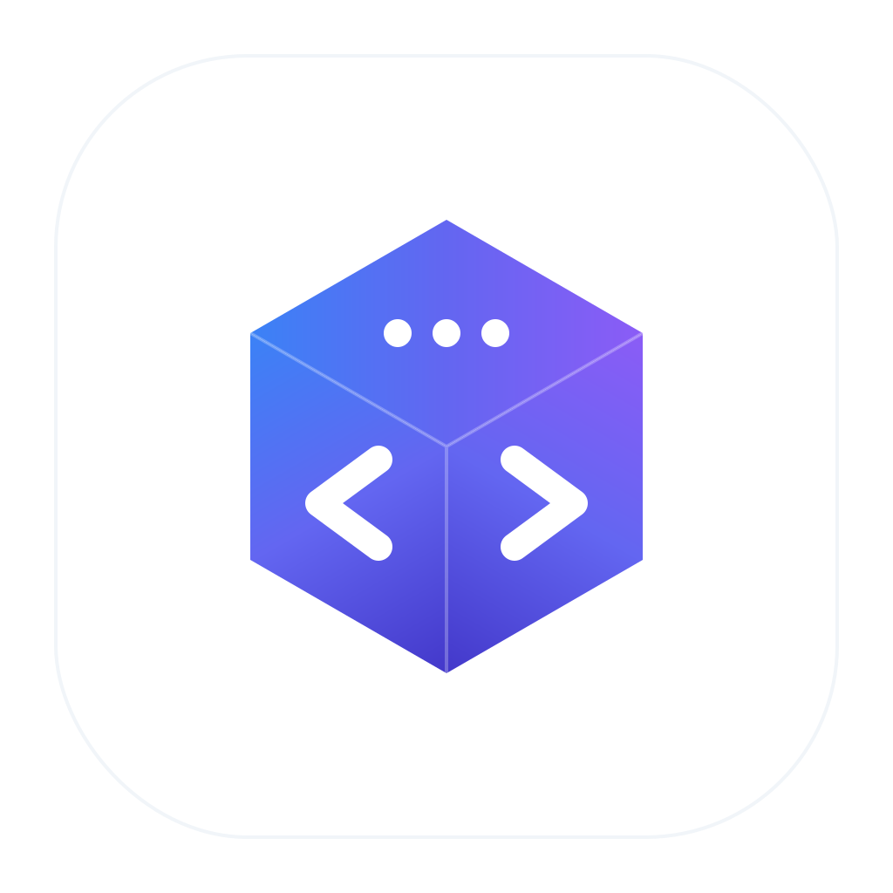

# Lattice Code

Open-source coding agent with a desktop chat app and a terminal CLI, powered by the Lattice Code harness.



Lattice Code is a compact local workbench where prompts, tool calls, and code context connect into useful changes.

This repository deliberately keeps a small scope:

- **CLI** (`lc`) — run the agent from your terminal
- **Electron desktop chat** — workspace picker, chat history, image attachments
- **Harness agent loop** (tools + LLM) shared by chat, CLI, and eval

## Quick Start (desktop)

```bash
pnpm install
cp .env.example .env
pnpm dev
```

Configure the provider from the app's **Settings** screen. Settings are stored locally in Electron's user data directory.

## CLI (`lc`)

The CLI uses the same harness engine as the desktop app: read/write files, bash, grep, session resume, and tool permissions.

### Install

**From this repo (development)**

```bash
pnpm install
pnpm --filter @lattice-code/cli build:deps
pnpm --filter @lattice-code/cli build
```

Run without a global install:

```bash
pnpm lc --help
pnpm dev:cli -i    # same as lc -i via tsx
```

**Global command (local link)**

```bash
pnpm --filter @lattice-code/cli build:deps
pnpm --filter @lattice-code/cli build
cd apps/cli && pnpm link --global
lc --version
```

**Global command (npm/pnpm publish)**

When `@lattice-code/cli` is published:

```bash
pnpm add -g @lattice-code/cli
# or: npm install -g @lattice-code/cli
```

### Configure API key and provider

Settings are stored in `~/.lattice-code/config.json` (override the directory with `LATTICE_CODE_HOME`).

**Option A — `config set` subcommand**

```bash
lc config set provider deepseek
lc config set api-key sk-your-key-here
lc config set model deepseek-v4-pro
lc config set provider deepseek api-key sk-... model deepseek-v4-pro
```

Supported keys: `provider`, `primaryModel` (alias `model`), `apiKey` (`api-key`), `baseUrl` (`base-url`).  
See `lc config set --help` for `key=value` syntax.

**Option B — environment variables**

```bash
export DEEPSEEK_API_KEY=sk-...
export LATTICE_CODE_MODEL=deepseek-v4-pro
export LATTICE_CODE_PROVIDER=deepseek
```

**Option C — repo `.env`**

From the project root, copy `.env.example` to `.env`. The CLI loads the nearest `.env` without overriding variables already set in the shell.

Priority for a run: **CLI flags** > **environment** > **`~/.lattice-code/config.json`**.

### Use the CLI

**One-shot task** (current directory as workspace):

```bash
lc "explain how authentication works in src/"
lc -c /path/to/repo "add tests for the parser"
```

**Interactive session** (multi-turn, same session):

```bash
lc -i
# › fix the failing test in tests/foo.test.ts
# › now run the test suite
# /exit
```

**Resume a session**:

```bash
lc --resume -s <session-id> "continue where we left off"
```

**Pipe a prompt**:

```bash
echo "review the diff and suggest improvements" | lc
```

**Auto-approve tool permissions** (CI or trusted environments):

```bash
lc -y "run the linter and fix issues"
```

**Other useful flags**

| Flag | Description |
|------|-------------|
| `-v` | Verbose tool output |
| `--no-trace` | Disable JSONL traces under `~/.lattice-code/traces/cli/` |
| `--model`, `--provider`, `--api-key`, `--base-url` | Override config for one run |

Full option list: `lc --help`.

## Security Notes

- Agent runs use the harness permission guard. Destructive or sensitive tool calls can require explicit confirmation in the UI (desktop) or in the terminal (CLI). Use `-y` only when you trust the environment.
- Links rendered from chat messages are not allowed to create new Electron windows. External `http` and `https` links open in the system browser; other protocols are ignored.
- API keys in desktop Settings are stored locally in Electron's user data directory (`chat-desktop-settings.json`). CLI keys live in `~/.lattice-code/config.json`. Neither uses the OS keychain yet.
- Runtime data is stored under `~/.lattice-code` by default. Set `LATTICE_CODE_HOME` to use a different directory.
- Harness sessions, chat threads, and agent traces are persisted under `LATTICE_CODE_HOME`. See [docs/design/lattice-code-home-layout.md](docs/design/lattice-code-home-layout.md).

## Provider Support

Presets are available for:

- Anthropic
- DeepSeek
- Kimi
- GLM
- Amazon Bedrock
- Google Vertex AI
- Custom OpenAI-compatible endpoints

Desktop Settings and `lc config set` both map to the harness LLM client (`apiKey`, `baseUrl`, `model` / `primaryModel`).

## Project Layout

- `apps/cli`: Terminal CLI (`lc` binary).
- `apps/chat-desktop`: Electron main process, preload bridge, and React renderer.
- `packages/harness`: Standalone coding agent loop (tools + LLM) for chat, CLI, and automation.
  - `packages/harness/eval/tasks`: Synthetic integration tasks (daily harness iteration).
  - `packages/harness/eval/swe-bench`: [SWE-bench](packages/harness/eval/swe-bench/README.md) real-repo benchmark (Mac agent + cloud Docker eval).
- `packages/sdk-runtime`: LLM provider presets.
- `packages/sdk-core`: `AgentEngine` interface shared by harness, desktop, and CLI.
- `packages/shared-types`: shared event and tool protocol types.
- `packages/storage-core`: local workspace/thread storage helpers.

## Development Commands

```bash
pnpm typecheck
pnpm --filter @lattice-code/chat-desktop build
pnpm --filter @lattice-code/chat-desktop start

# CLI
pnpm --filter @lattice-code/cli build:deps
pnpm --filter @lattice-code/cli build
pnpm --filter @lattice-code/cli test
pnpm lc --help

# Harness eval (synthetic tasks; reads DEEPSEEK_API_KEY from repo-root .env)
pnpm eval

# SWE-bench — Mac agent → cloud Docker → analyze traces
pnpm eval:swe -- --dataset lite --limit 3 --skip-eval --run-id my-run
pnpm eval:swe:analyze -- my-run                    # after cloud grading JSON is local
# Full loop: packages/harness/eval/swe-bench/WORKFLOW.md
```

Cursor skill: `.cursor/skills/swe-bench-eval/` (proxy tunnel, scp, `resolved_ids` / `unresolved_ids`, trace debug).

## Brand Assets

The source icon and brand notes live in `brand/`.
