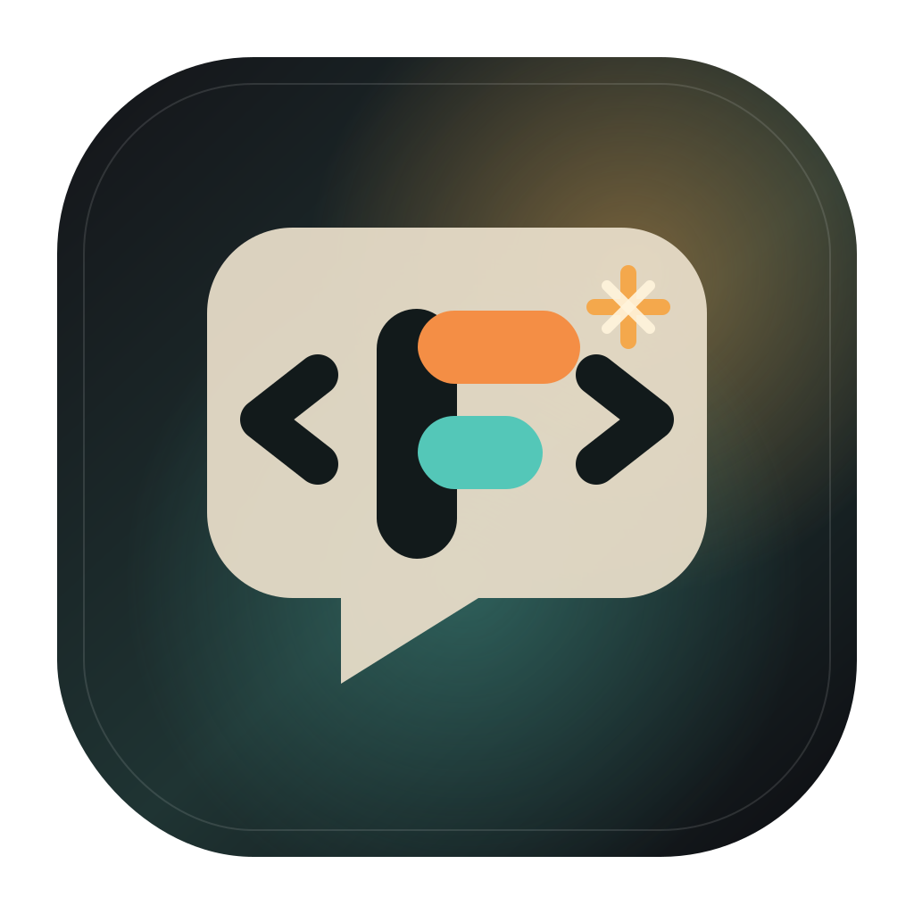

# Forgelet

Open-source desktop chat client for coding agents powered by the Forgelet harness.



Forgelet means "a small forge": a compact local workbench where prompts, tool calls, and code context are shaped into useful changes.

This repository deliberately keeps a small scope:

- Electron desktop chat UI
- workspace picker and workspace-scoped chat history
- image attachments and clipboard image paste
- local model provider settings
- Harness agent loop (tools + LLM) for chat and eval

## Quick Start

```bash
pnpm install
cp .env.example .env
pnpm dev
```

You can configure the provider from the app's Settings screen. Settings are stored locally in Electron's user data directory.

## Security Notes

- Agent runs use the harness permission guard. Destructive or sensitive tool calls can require explicit confirmation in the UI.
- Links rendered from chat messages are not allowed to create new Electron windows. External `http` and `https` links open in the system browser; other protocols are ignored.
- API keys saved in Settings are stored locally in Electron's user data directory as part of `chat-desktop-settings.json`. This is convenient for local development, but it is not an OS keychain-backed secret store yet.
- Runtime data is stored under `~/.forgelet` by default. Set `FORGELET_HOME` to use a different directory.
- Harness sessions, chat threads, and agent traces are persisted under `FORGELET_HOME` (default `~/.forgelet`). See [docs/design/forgelet-home-layout.md](docs/design/forgelet-home-layout.md).

## Provider Support

The app includes presets for:

- Anthropic
- DeepSeek
- Kimi
- GLM
- Amazon Bedrock
- Google Vertex AI
- Custom OpenAI-compatible endpoints

Settings map to the harness LLM client (`apiKey`, `baseUrl`, `model`).

## Project Layout

- `apps/chat-desktop`: Electron main process, preload bridge, and React renderer.
- `packages/harness`: Standalone coding agent loop (tools + LLM) for chat and automation.
  - `packages/harness/eval/tasks`: Synthetic integration tasks (daily harness iteration).
  - `packages/harness/eval/swe-bench`: [SWE-bench](packages/harness/eval/swe-bench/README.md) real-repo benchmark (Mac agent + cloud Docker eval).
- `packages/sdk-runtime`: LLM provider presets for the Settings UI.
- `packages/sdk-core`: `AgentEngine` interface shared by harness and desktop.
- `packages/shared-types`: shared event and tool protocol types.
- `packages/storage-core`: local workspace/thread storage helpers.

## Development Commands

```bash
pnpm typecheck
pnpm --filter @forgelet/chat-desktop build
pnpm --filter @forgelet/chat-desktop start

# Harness eval (synthetic tasks)
pnpm --filter @forgelet/harness eval

# SWE-bench (real repos; see packages/harness/eval/swe-bench/README.md)
pnpm --filter @forgelet/harness eval:swe -- --dataset lite --limit 3 --skip-eval
```

Cursor project skill for the full Mac + cloud workflow: `.cursor/skills/swe-bench-eval/`.

## Brand Assets

The source icon and brand notes live in `brand/`.
