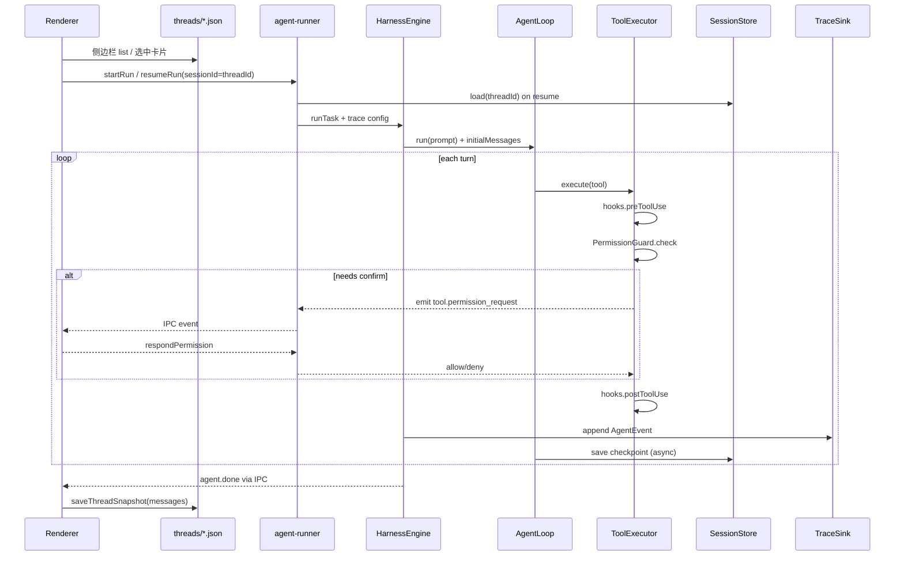

# Harness 与桌面端集成架构

> 描述 `packages/harness` 内核如何与 `apps/chat-desktop` 接线：Agent 循环、Session 续跑、权限确认、Hooks、事件流。  
> **存储路径、会话模型、目录布局**以 [lattice-code-home-layout.md](./lattice-code-home-layout.md) 为准。  
> **命令执行隔离**见 [execution-environment-isolation.md](./execution-environment-isolation.md)。

---

## 1. 职责边界

| 层 | 包 / 模块 | 职责 |
|----|-----------|------|
| **Harness 内核** | `packages/harness` | `AgentLoop`、`HarnessEngine`、`ToolExecutor`、`SessionStore`、`PermissionGuard`、Hooks、`TraceSink` |
| **桌面 Main** | `apps/chat-desktop` `agent-runner.ts` | 构造 Engine、注入 permission callback、IPC 转发 `AgentEvent`、管理 pending permission Promise |
| **桌面 Renderer** | `ChatList`、`Composer`、`useAgentRun`、`PermissionDialog` | 侧边栏、发消息、消费 IPC 事件、权限弹窗 |
| **存储** | `packages/storage-core` + `thread-store` | `LATTICE_CODE_HOME` 路径解析；Thread 列表仅扫 `threads/` |

---

## 2. 总体时序



---

## 3. Session 续跑

路径与 ID 约定见 [layout §2–§3、§8](./lattice-code-home-layout.md)。

### 3.1 Harness API

```ts
// session-store.ts — 构造依赖 workspaceRoot（用于 hash）
export class SessionStore {
  constructor(options: { workspaceRoot: string } | string /* storeDir 高级覆盖 */);
}

// harness-engine.ts
export interface HarnessEngineOptions {
  sessionStore?: SessionStore;
  persistSession?: boolean;            // default true
  trace?: TraceConfig;                 // 见 layout §6
  hooks?: HarnessHooks;
  onPermissionConfirm?: PermissionCallback;
}

// agent-loop.ts
export interface AgentLoopOptions {
  initialMessages?: ChatMessage[];
  onMessagesChanged?: (messages: ChatMessage[]) => void;
}
```

### 3.2 Resume 语义

1. `runMode === "resume"` → `SessionStore.load(threadId)` → 注入 `AgentLoop` 的 `initialMessages`
2. 完整 `messages[]`（含 system、assistant/tool、`reasoning_content`）参与续跑
3. Composer 新输入 = 单条 user 消息（**不**再塞整段 `[THREAD_CONTEXT]`）；仅附加 `[WORKSPACE_ROOT]` 等短 envelope
4. 每个 turn 结束后异步 `save`（防抖 500ms）；`agent.done` / `agent.error` 时强制 flush

### 3.3 桌面端接线

| 模块 | 行为 |
|------|------|
| `agent-runner.ts` | `SessionStore({ workspaceRoot })`；resume 时 `load(threadId)` |
| **New Chat** | 生成 `threadId`，写 `threads/{threadId}.json` |
| **Send** | 有 `threadId` 则 **始终** `resume` + `sessionId=threadId` |
| `Composer` | 以 `threadId` 为准，不要求 `sessionId && threadId` 双存在才 resume |
| `thread-store` | 列表仅 `listStoredThreads` → `workspaces/{hash}/threads/` |
| `ChatList` | 选中卡片 → `setSessionId(threadId)` |
| `AppContext` | 保存 thread 时 `id === sessionId` |

**真相源分工**：Session 为 Harness 续跑真相；Thread 为 UI 展示真相；run 结束后同步 `Thread.messages`。

---

## 4. 权限确认（Permission Confirm）

### 4.1 事件协议（`packages/shared-types`）

```ts
| "tool.permission_request"   // Main → Renderer：请用户确认
| "tool.permission_resolved"  // 可选，用于 UI 关闭 pending 状态
```

```ts
interface ToolPermissionRequestPayload {
  requestId: string;
  toolCallId?: string;
  toolName: string;
  args: Record<string, unknown>;
  reason: string;
  decision: "ask";
}

interface ToolPermissionResponse {
  requestId: string;
  outcome: "allow_once" | "allow_always" | "deny";
}
```

`tool.error` / `ToolErrorPayload` 已有 `decision?: PermissionDecision`，拒绝时填 `"deny"`。

### 4.2 Main 进程阻塞模型

```ts
// agent-runner.ts
const pendingPermissions = new Map<string, {
  resolve: (ok: boolean) => void;
  sessionId: string;
}>();

function createPermissionCallback(sender: WebContents, sessionId: string): PermissionCallback {
  return (toolName, args, reason) => new Promise((resolve) => {
    const requestId = randomUUID();
    pendingPermissions.set(requestId, { resolve, sessionId });
    emitAgentEvent(sender, { type: "tool.permission_request", ... });
  });
}

// IPC: chat-desktop:respond-permission
```

`HarnessEngine` → `ToolExecutor` 注入 `onPermissionConfirm`。关窗 abort → deny all pending。

**`allow_always`**：session 级 allowlist（内存 + 可选 `LATTICE_CODE_HOME/workspaces/{hash}/permission-allowlist.json`），**不写用户 repo**。

### 4.3 Renderer

- `PermissionDialog`（Modal）展示待确认工具调用
- `useAgentRun` 监听 `tool.permission_request`，调 `respondPermission`
- 运行态扩展 **waiting_permission**（pending 栈或 `runState`）

---

## 5. Hooks 扩展点

接口见 `packages/harness/src/hooks.ts`：

```ts
export interface HarnessHooks {
  preToolUse?: (ctx: PreToolUseContext) => Promise<PreToolUseResult | void>;
  postToolUse?: (ctx: PostToolUseContext) => Promise<void>;
}
```

**调用顺序**（`ToolExecutor.execute`）：

```text
preToolUse → PermissionGuard.check → [执行工具] → postToolUse
```

- 桌面通过 `HarnessEngineOptions.hooks` 注入策略 hook
- **轨迹**由 `TraceSink` 在 `emitEvent` 统一写入（见 [layout §6](./lattice-code-home-layout.md)），**不**与 `postToolUse` 重复写 audit 文件
- 项目级 `.lattice-code/hooks.json` 仅声明内置 hook id（不执行任意 shell）

---

## 6. 轨迹（Trace）

完整约定见 [lattice-code-home-layout.md §6](./lattice-code-home-layout.md)。

- `HarnessEngine.emitEvent` → `JsonlTraceSink` + IPC fan-out
- 桌面：`traces/desktop/{workspaceHash}/{threadId}/trace.jsonl`
- 禁止把 `AgentEvent` 流写入 session JSON（Session 与 Trace 分工见 layout §3）

---

## 7. 关键决策

| 议题 | 决策 |
|------|------|
| `threadId` vs `agentSessionId` | **永远相等**（见 layout §1） |
| 侧边栏列表 | **仅** `workspaces/{hash}/threads/` |
| Confirm 阻塞 | Main Promise；关窗 → deny all pending |
| `reasoning_content` | 全量持久化到 Session |
| 轨迹 vs Session | Session = 模型工作记忆；Trace = 黑匣子，不参与推理 |
