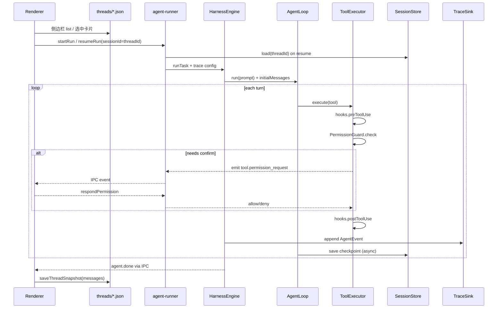

# Harness P1：产品化方案设计

> 分支：`feature/harness-p1-productization`  
> 目标：在现有 ~2k 行 harness 内核上，补齐 **权限确认 UI、Session 真续跑、Hooks 扩展点、统一存储布局**，使桌面端可日常可用。  
> 非目标：OS 沙箱、MCP 生态、多 Agent 编排（归入 P2/P3）。

**存储与会话模型**（路径、threadId、侧边栏、traces/runs）以 **[lattice-code-home-layout.md](./lattice-code-home-layout.md)** 为准；本文侧重 Harness 与桌面集成。

---

## 1. 背景与现状

| 能力 | Harness 现状 | 桌面端现状 |
|------|-------------|-----------|
| Agent 循环 | `AgentLoop` + `HarnessEngine` | `agent-runner.ts` 已接入 |
| 权限 | `PermissionGuard` + 正则 policy | 无 `onPermissionConfirm`，confirm 规则等同拒绝 |
| 会话 | `SessionStore` 写 **用户 repo** 内 `harness-sessions` | `resume` 应恢复 `messages[]`；列表不应依赖 repo 内路径 |
| 侧边栏 | — | `threads/` 已在 `LATTICE_CODE_HOME`；列表曾混扫 harness-sessions / 旧 snapshot |
| Hooks | `preToolUse` / `postToolUse` 已有 | 未注册；轨迹未统一 |
| 事件 | `AgentEvent` 经 IPC | `useAgentRun` 已消费；**默认不落盘 trace** |

**P1 已拍板（见 layout 文档）**

- `threadId === agentSessionId`（一张卡片一个 ID）
- 侧边栏 **只扫** `LATTICE_CODE_HOME/workspaces/{workspaceHash}/threads/*.json`
- Session：`LATTICE_CODE_HOME/sessions/{workspaceHash}/{sessionId}.json`
- Trace / 评测 runs：repo 外，见 [lattice-code-home-layout.md §4–§6](./lattice-code-home-layout.md)

---

## 2. 总体架构



---

## 3. 子系统设计

### 3.1 Session Resume（真续跑）

#### 3.1.1 存储

- **路径**：`${LATTICE_CODE_HOME}/sessions/{workspaceHash}/{sessionId}.json`（**不在**用户 workspace 内）
- **ID**：`sessionId === threadId`（侧边栏卡片 ID）
- **格式**：`SessionData`（`messages` + `metadata`）
- **写入时机**：
  - 每个 turn 结束后异步 `save`（防抖 500ms）
  - `agent.done` / `agent.error` 时强制 flush
- **读取**：`runMode === "resume"` → `load(sessionId)` → 注入 `AgentLoop`

#### 3.1.2 Harness API 变更

```ts
// session-store.ts — 构造依赖 workspaceRoot（用于 hash），不再 resolveHarnessSessionDir(repo)
export class SessionStore {
  constructor(options: { workspaceRoot: string } | string /* storeDir 高级覆盖 */);
}

// harness-engine.ts
export interface HarnessEngineOptions {
  sessionStore?: SessionStore;
  persistSession?: boolean;            // default true
  trace?: TraceConfig;                 // 见 layout §6；P1d
}

// agent-loop.ts
export interface AgentLoopOptions {
  initialMessages?: ChatMessage[];
  onMessagesChanged?: (messages: ChatMessage[]) => void;
}
```

**Resume 语义**

1. `load(threadId)` → 完整 `messages[]`（含 system、assistant/tool、`reasoning_content`）
2. Composer 新输入 = 单条 user 消息（**不**再塞整段 `[THREAD_CONTEXT]`）
3. 仅附加 `[WORKSPACE_ROOT]` 等短 envelope

#### 3.1.3 桌面端

| 改动点 | 说明 |
|--------|------|
| `agent-runner.ts` | `SessionStore({ workspaceRoot })` → `sessions/{hash}/{sessionId}.json` |
| **New Chat** | 生成 `threadId`，写 `threads/{threadId}.json` |
| **Send** | 有 `threadId` 则 **始终** `resume` + `sessionId=threadId`；无 thread 时 `run` 且 `sessionId=threadId` |
| `Composer` | 不再要求 `sessionId && threadId` 才 resume；以 `threadId` 为准 |
| `thread-store` | **列表仅** `listStoredThreads` → `workspaces/{hash}/threads/`；移除从 `harness-sessions` 拼列表 |
| `ChatList` | 选中卡片 → `setSessionId(threadId)`；废弃 `runSessionIds[0]` 启发式 |
| `AppContext` | 保存 thread 时 `id === sessionId`，不再维护 `runSessionIds` |

#### 3.1.4 兼容与迁移

- 旧 `{workspace}/.lattice-code/harness-sessions/`：**不**作为列表源；可选只读 import，非 P1 必须
- 旧 `loadSessionThread` / SDK snapshot：**不**驱动侧边栏；可选单卡历史回显
- `ChatMessage.reasoning_content` 全量持久化（DeepSeek 续跑）

---

### 3.2 权限 UI（Permission Confirm）

#### 3.2.1 事件协议（shared-types）

新增事件类型：

```ts
| "tool.permission_request"   // Main → Renderer：请用户确认
| "tool.permission_resolved"  // 可选，用于 UI 关闭 pending 状态
```

```ts
interface ToolPermissionRequestPayload {
  requestId: string;
  toolCallId?: string;
  toolName: string;
  args: Record<string, unknown>;
  reason: string;
  decision: "ask";
}

interface ToolPermissionResponse {
  requestId: string;
  outcome: "allow_once" | "allow_always" | "deny";
}
```

`tool.error` / `ToolErrorPayload` 已有 `decision?: PermissionDecision`，拒绝时填 `"deny"`。

#### 3.2.2 Main 进程阻塞模型

```ts
// agent-runner.ts
const pendingPermissions = new Map<string, {
  resolve: (ok: boolean) => void;
  sessionId: string;
}>();

function createPermissionCallback(sender: WebContents, sessionId: string): PermissionCallback {
  return (toolName, args, reason) => new Promise((resolve) => {
    const requestId = randomUUID();
    pendingPermissions.set(requestId, { resolve, sessionId });
    emitAgentEvent(sender, { type: "tool.permission_request", ... });
  });
}

// IPC: chat-desktop:respond-permission
```

`HarnessEngine` → `ToolExecutor` 注入 `onPermissionConfirm`。

**`allow_always`**：session 级 allowlist（内存 + 可选 `LATTICE_CODE_HOME/workspaces/{hash}/permission-allowlist.json`），**不写用户 repo**。

#### 3.2.3 Renderer UI

- 组件：`PermissionDialog`（Modal）
- `useAgentRun`：监听 `tool.permission_request`，调 `respondPermission`
- 运行中：**waiting_permission**（pending 栈或扩展 `runState`）

#### 3.2.4 Policy 配置（Phase 1b 可选）

- 设置页展示 `DEFAULT_POLICY` deny 列表
- 用户 rules → `settings.json`（Electron userData）

---

### 3.3 Hooks 扩展点

#### 3.3.1 接口（harness）

见 `packages/harness/src/hooks.ts`：

```ts
export interface HarnessHooks {
  preToolUse?: (ctx: PreToolUseContext) => Promise<PreToolUseResult | void>;
  postToolUse?: (ctx: PostToolUseContext) => Promise<void>;
}
```

**调用顺序**（`ToolExecutor.execute`）：

```
preToolUse → PermissionGuard.check → [执行工具] → postToolUse
```

#### 3.3.2 桌面注册（Phase 1c）

- `HarnessEngineOptions.hooks` 注入策略 hook
- **轨迹**：由 `TraceSink` 在 `emitEvent` 统一写入（见 layout §6），**不**与 postToolUse 重复写 audit 文件
- **不做** shell 脚本 hooks（P2）

#### 3.3.3 项目级配置（可选延后）

`LATTICE_CODE_HOME` 或 workspace 内 `.lattice-code/hooks.json` 仅声明内置 hook id（不执行任意 shell）。

---

### 3.4 统一轨迹（P1d，概要）

完整约定见 [lattice-code-home-layout.md §6](./lattice-code-home-layout.md)。

- `HarnessEngine.emitEvent` → `JsonlTraceSink` + IPC
- 桌面：`traces/desktop/{workspaceHash}/{threadId}/trace.jsonl`
- swe-bench / eval：默认开启；产物在 `LATTICE_CODE_HOME/traces` 与 `LATTICE_CODE_HOME/runs`
- 废弃 `--save-traces`、repo 内 `packages/harness/eval/swe-bench/runs/` 作为默认输出

---

## 4. 实施分期

| 阶段 | 内容 | 交付物 |
|------|------|--------|
| **1a** | Session 迁 `LATTICE_CODE_HOME/sessions/{hash}/`；`threadId===sessionId`；resume 语义；侧边栏仅 threads | storage-core 路径 helper、`SessionStore`、`agent-runner`、thread-store、Composer |
| **1b** | 权限 IPC + Dialog | shared-types、UI |
| **1c** | Hooks 注册（策略）；与 Trace 分离 | executor、单测 |
| **1d** | TraceSink + eval/swe 输出迁出 repo | `trace-sink.ts`、runner、README |

**依赖**：1a 与 1b 可并行；1d 依赖 1a 的 `emitEvent` 稳定；1c 与 1d 可部分并行。

---

## 5. 测试策略

| 层 | 内容 |
|----|------|
| 单元 | `SessionStore` 使用 `LATTICE_CODE_HOME` 临时目录 + `workspaceHash`；hooks pre/post |
| 集成 | 同一 `threadId` 连续两轮 resume，第二轮能引用上一轮 tool 结果 |
| 手测 | New Chat → 多轮 Send 不换 sessionId；侧边栏仅 threads 列表；切换卡片后 resume |

Eval 不改变 plan 基线；swe-bench 默认带 trace（1d）。

---

## 6. 风险与决策

| 议题 | 决策 |
|------|------|
| Resume 与 UI messages | **Session** 为 Harness 真相；Thread 为 UI 真相；run 结束后同步 Thread.messages |
| `threadId` vs `agentSessionId` | **永远相等** |
| 侧边栏列表 | **仅** `workspaces/{hash}/threads/` |
| Confirm 阻塞 | Main Promise；关窗 abort → deny all pending |
| `reasoning_content` | 全量持久化；P2 可压缩 |
| 轨迹 vs Session | 分工见 layout §3；禁止把 `AgentEvent` 流写入 session JSON |

---

## 7. 文件改动清单（预估）

**packages/storage-core**

- `paths.ts` — `resolveHarnessSessionPath(workspaceRoot, sessionId)` → `sessions/{hash}/{id}.json`

**packages/harness**

- `session-store.ts` — 按 workspaceHash 分目录；弃用 `resolveHarnessSessionDir(workspaceRoot)` 写 repo
- `harness-engine.ts` — SessionStore、TraceSink（1d）、permission、hooks
- `agent-loop.ts`、`tools/executor.ts`、`permissions.ts`
- `trace-sink.ts`（新，1d）
- `tests/session-resume.test.ts`、`tests/hooks.test.ts`

**packages/shared-types**

- `events.ts` — permission 事件

**apps/chat-desktop**

- `agent-runner.ts` — SessionStore(workspaceRoot)、trace 配置
- `thread-store.ts` — 仅 threads 列表；去掉 harness-sessions 列表逻辑
- `ChatList.tsx`、`Composer.tsx`、`AppContext.tsx` — `sessionId=threadId`、始终 resume
- `useAgentRun.ts`、`PermissionDialog.tsx`、ipc/preload

**docs**

- [lattice-code-home-layout.md](./lattice-code-home-layout.md)（布局真相源）

---

## 8. 验收标准

- [ ] 同一 `threadId` 连续两次 Send（resume），模型能引用上一轮 tool 结果
- [ ] `threadId === sessionId` 全链路一致；New Chat 不复用旧 sessionId
- [ ] 侧边栏列表 **仅**来自 `LATTICE_CODE_HOME/workspaces/{hash}/threads/`
- [ ] Session 文件 **不在**用户 workspace 的 `.lattice-code/` 下
- [ ] `git push` 确认弹窗；拒绝后 agent 可继续
- [ ] `preToolUse` deny 不执行工具
- [ ] （1d）swe-bench 跑完在 `LATTICE_CODE_HOME/traces/swe-bench/{runId}/` 可见 jsonl
- [ ] 单元测试 ≥ 50 通过（含新增）

---

## 9. 后续（P2 预览，不在本分支）

- 从 trace 回放 UI；`@file` 引用、子 agent
- Settings 可视化 permission rules
- Shell-based hooks（安全审查）
- 旧数据一次性迁移工具
