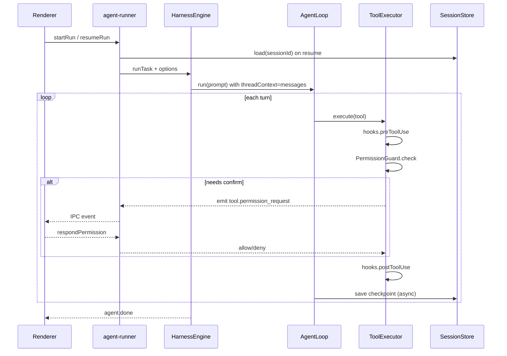

# Harness P1：产品化方案设计

> 分支：`feature/harness-p1-productization`  
> 目标：在现有 ~2k 行 harness 内核上，补齐 **权限确认 UI、Session 真续跑、Hooks 扩展点**，使桌面端可日常可用。  
> 非目标：OS 沙箱、MCP 生态、多 Agent 编排（归入 P2/P3）。

---

## 1. 背景与现状

| 能力 | Harness 现状 | 桌面端现状 |
|------|-------------|-----------|
| Agent 循环 | `AgentLoop` + `HarnessEngine` | `agent-runner.ts` 已接入 |
| 权限 | `PermissionGuard` + 正则 policy | 无 `onPermissionConfirm`，confirm 规则等同拒绝 |
| 会话 | `SessionStore`（JSON CRUD） | `resume` 仅拼 `[THREAD_CONTEXT]` 文本，**不恢复 `messages[]`** |
| Hooks | 无 | 无 |
| 事件 | `tool.called/output/error` | `useAgentRun` 已消费 |

遗留路径（Claude SDK 时代）：

- `{workspace}/.forgelet/query-loop-sessions/{id}.json`
- `{workspace}/.forgelet/sessions/{id}.json`
- `thread-store` 读 snapshot 建侧边栏列表

P1 新增统一路径，与旧数据 **只读兼容、写入走新路径**。

---

## 2. 总体架构



---

## 3. 子系统设计

### 3.1 Session Resume（真续跑）

#### 3.1.1 存储

- **路径**：`{workspaceRoot}/.forgelet/harness-sessions/{sessionId}.json`
- **格式**：复用 `SessionData`（`messages` + `metadata`）
- **写入时机**：
  - 每个 turn 结束后异步 `save`（防抖 500ms，避免 IO 风暴）
  - `agent.done` / `agent.error` 时强制 flush
- **读取**：`runMode === "resume"` 且存在文件 → `load` → 注入 `AgentLoop`

#### 3.1.2 Harness API 变更

```ts
// harness-engine.ts
export interface HarnessEngineOptions {
  // ...
  sessionStore?: SessionStore;       // 默认 workspace/.forgelet/harness-sessions
  persistSession?: boolean;            // 默认 true
}

// agent-loop.ts
export interface AgentLoopOptions {
  initialMessages?: ChatMessage[];   // resume 时跳过仅 system+空，直接 append user
  onMessagesChanged?: (messages: ChatMessage[]) => void;  // 供 engine 持久化
}
```

**Resume 语义**：

1. `load(sessionId)` → `messages`（含 system、历史 assistant/tool）
2. 新 user 消息 = 桌面 Composer 输入（不再塞整段 `THREAD_CONTEXT` 进单条 user）
3. 可选保留 `buildAgentPromptEnvelope` 仅附加 `[WORKSPACE_ROOT]` 一行

#### 3.1.3 桌面端

| 改动点 | 说明 |
|--------|------|
| `agent-runner.ts` | 创建 `SessionStore(workspace/.forgelet/harness-sessions)`，传给 `HarnessEngine` |
| `resume-run` | `load` 失败 → 降级为当前文本 resume（兼容旧线程） |
| `useAgentRun` | `resumePrompt` 前可选 `loadHarnessSession` IPC 恢复 UI messages（与 harness 对齐） |
| `thread-store` | 列表 metadata 增加 `harnessSession: true` 标记（渐进） |

#### 3.1.4 兼容与迁移

- 不自动迁移旧 snapshot；`loadSessionThread` 仍服务历史列表
- 新会话统一写 `harness-sessions`
- `ChatMessage.reasoning_content` 必须持久化（DeepSeek 续跑必需）

---

### 3.2 权限 UI（Permission Confirm）

#### 3.2.1 事件协议（shared-types）

新增事件类型：

```ts
| "tool.permission_request"   // Main → Renderer：请用户确认
| "tool.permission_resolved"  // 可选，用于 UI 关闭 pending 状态
```

```ts
interface ToolPermissionRequestPayload {
  requestId: string;          // 关联 pending promise
  toolCallId?: string;
  toolName: string;
  args: Record<string, unknown>;
  reason: string;
  decision: "ask";            // 固定 ask
}

interface ToolPermissionResponse {
  requestId: string;
  outcome: "allow_once" | "allow_always" | "deny";
}
```

`tool.error` / `ToolErrorPayload` 已有 `decision?: PermissionDecision`，拒绝时填 `"deny"`。

#### 3.2.2 Main 进程阻塞模型

```ts
// agent-runner.ts
const pendingPermissions = new Map<string, {
  resolve: (ok: boolean) => void;
  sessionId: string;
}>();

function createPermissionCallback(sender: WebContents, sessionId: string): PermissionCallback {
  return (toolName, args, reason) => new Promise((resolve) => {
    const requestId = randomUUID();
    pendingPermissions.set(requestId, { resolve, sessionId });
    emitAgentEvent(sender, { type: "tool.permission_request", ... });
    // 超时 5min 默认 deny
  });
}

// IPC: chat-desktop:respond-permission
```

`HarnessEngine` → `ToolExecutor` 注入 `onPermissionConfirm`。

**`allow_always`**：写入 session 级 allowlist（内存 + 可选 `{workspace}/.forgelet/permission-allowlist.json`），对 bash 存 command 前缀或正则。

#### 3.2.3 Renderer UI

- 组件：`PermissionDialog`（Modal）
  - 展示：tool 名、bash command、path、reason
  - 按钮：拒绝 / 允许一次 / 始终允许（bash 可对当前 pattern）
- `useAgentRun`：监听 `tool.permission_request`，调 `respondPermission`
- 运行中若弹窗：agent 处于 **waiting_permission** 子状态（`runState` 扩展或本地 pending 栈）

#### 3.2.4 Policy 配置（Phase 1b 可选）

- 设置页读取 `DEFAULT_POLICY` 的 deny 列表（只读展示）
- 用户自定义 rules 存 `settings.json` → 序列化正则字符串 → `PermissionPolicy`

---

### 3.3 Hooks 扩展点

#### 3.3.1 接口（harness）

新文件 `packages/harness/src/hooks.ts`：

```ts
export interface PreToolUseResult {
  allow: boolean;
  args?: Record<string, unknown>;
  reason?: string;
}

export interface HarnessHooks {
  preToolUse?: (
    ctx: { toolName: string; args: Record<string, unknown>; sessionId?: string },
  ) => Promise<PreToolUseResult | void>;

  postToolUse?: (
    ctx: { toolName: string; args: Record<string, unknown>; result: ToolExecutionResult },
  ) => Promise<void>;
}
```

**调用顺序**（`ToolExecutor.execute`）：

```
preToolUse → PermissionGuard.check → [执行工具] → postToolUse
```

`preToolUse` 返回 `{ allow: false }` 时等同 deny，不弹权限 UI。

#### 3.3.2 桌面注册（Phase 1c）

- `HarnessEngineOptions.hooks`
- 内置示例 hook：`audit-log.ts` 追加到 `{appData}/logs/tool-audit.jsonl`（仅 Main）
- **不做** shell 脚本 hooks（Claude Code 级，放 P2）

#### 3.3.3 项目级配置（可选延后）

`.forgelet/hooks.json` 仅声明启用哪些内置 hook id，不执行任意 shell。

---

## 4. 实施分期

| 阶段 | 内容 | 交付物 | 估时 |
|------|------|--------|------|
| **1a** | Session 持久化 + resume | harness API、agent-runner、单测 | 中 |
| **1b** | 权限 IPC + Dialog | shared-types 事件、UI、E2E 手测 | 中 |
| **1c** | Hooks API + audit hook | hooks.ts、executor 集成、单测 | 小 |
| **1d** | 文档 + 回归 | eval 仍默认 loop；README 片段 | 小 |

**依赖顺序**：1a 与 1b 可并行；1c 依赖 1b 的 executor 管线稳定。

---

## 5. 测试策略

| 层 | 内容 |
|----|------|
| 单元 | `SessionStore` round-trip；`PermissionGuard` + mock confirm；hooks pre/post |
| 集成 | 临时目录跑 `AgentLoop` resume 两轮对话；deny bash 返回 tool error |
| 手测 | 桌面 `git push` 弹窗；关窗重开 resume 同一 sessionId |

Eval **不切换** plan 模式；P1 不改变 eval pass 基线。

---

## 6. 风险与决策

| 议题 | 决策 |
|------|------|
| Resume 与 UI messages 双份状态 | **以 harness SessionStore 为 source of truth**；UI 从 IPC 同步或 run 结束后 reload |
| Confirm 阻塞 API | Main 进程 Promise 等待；agent 仍在 running，需处理用户关窗 → abort → deny all pending |
| 正则 policy 序列化 | 存 string[]，`new RegExp(s)` 加载；无效 pattern 忽略并 log |
| `reasoning_content` 体积 | 全量持久化；后续 P2 可做压缩 strip |

---

## 7. 文件改动清单（预估）

**packages/harness**

- `hooks.ts`（新）
- `agent-loop.ts` — `initialMessages`, checkpoint callback
- `harness-engine.ts` — SessionStore, hooks, permission callback 透传
- `tools/executor.ts` — 集成 hooks
- `permissions.ts` — session allowlist
- `tests/session-resume.test.ts`, `tests/hooks.test.ts`（新）

**packages/shared-types**

- `events.ts` — 新事件类型与 payload

**apps/chat-desktop**

- `agent-runner.ts` — SessionStore、permission pending map
- `ipc/chat.ipc.ts`, `preload.cjs` — `respond-permission`
- `useAgentRun.ts` — 处理 permission 事件
- `PermissionDialog.tsx`（新）
- `types.ts` — DesktopConfig 扩展

---

## 8. 验收标准

- [ ] 同一 `sessionId` 连续两次 resume，模型能引用上一轮 tool 结果（不靠 THREAD_CONTEXT 堆砌）
- [ ] `git push` 触发确认弹窗，拒绝后 tool 返回 deny 且 agent 可继续
- [ ] `allow_always` 后同 pattern 不再弹窗（当前 session）
- [ ] `preToolUse` deny 不调用 LLM 工具执行
- [ ] 单元测试 ≥ 50 通过（含新增）

---

## 9. 后续（P2 预览，不在本分支）

- 索引 / `@file` 引用、子 agent
- Settings 可视化 permission rules 编辑器
- Shell-based hooks（需安全审查）
