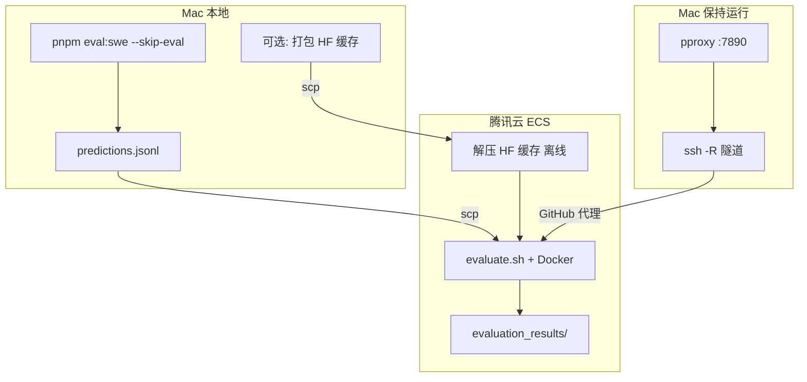
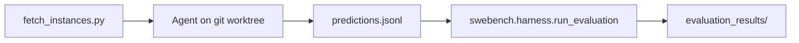

# SWE-bench 评测

用 [SWE-bench](https://github.com/SWE-bench/SWE-bench) 真实开源仓库做**最终验证**：本 harness 负责 agent 推理并生成 patch，官方 Docker harness 在隔离环境里跑测试判定是否 resolved。

推荐分工：**Mac 跑 Agent**（也可在 ECS 直接 `docker-batch.sh` 跑），**国内云（腾讯云等）跑 Docker 评测**。

> 📖 **实操指南以 [WORKFLOW.md](./WORKFLOW.md) 为准** —— 本 README 里部分小节（特别是 sb-cli 相关、early evaluate.sh 配方）已过时。当前规范路径是：Mac → ECS agent batch → ECS 跑 `python -m swebench.harness.run_evaluation`（走 Mac pproxy 反向隧道）→ Mac 拉报告。
>
> ⚠️ **sb-cli 后端目前对 `swe-bench_lite` test/dev 都坏**——gold patch 都返回 `0/N resolved`，**不要用 `sb-cli submit`**。

---

## 完整一次评测流程（端到端）

### 总览



| 阶段 | 在哪里 | 产出 | 耗时量级 |
|------|--------|------|----------|
| 1. 拉任务 + Agent | Mac | `predictions.jsonl` | 每条数分钟～数十分钟 |
| 2. 传文件 | Mac → 云 | 云上 `predictions.jsonl` | 秒级 |
| 3. Docker 评测 | 云 | `evaluation_results/<run-id>/` | 每条数十分钟～数小时（首次更久） |

**不要混淆：**

- `eval:swe --skip-eval` = 只「做题」（生成 patch），**不是** SWE-bench 评分。
- `evaluate.sh` = 「阅卷」（容器里跑测试），看 **resolved** 才算通过。

---

### 0. 仓库与目录

SWE-bench 评测在 **Forgelet monorepo**（本仓库 `coding-agent-chat-oss`）内，与桌面端、harness 共用同一 git 仓库：

```text
coding-agent-chat-oss/                 # 仓库根（在此执行 pnpm install / eval:swe）
├── packages/harness/
│   ├── eval/
│   │   ├── tasks/                       # 内置合成任务（日常迭代）
│   │   └── swe-bench/                   # SWE-bench 真实仓库评测（本文档）
│   │       ├── run.ts                   # Agent + 可选云端评测入口
│   │       ├── evaluate.sh              # 官方 Docker harness（多在云上执行）
│   │       ├── runs/eval-<run-id>/      # Agent 产出（gitignore）
│   │       └── repos/                   # 真实仓库 bare clone 缓存（gitignore）
│   └── src/                             # harness 引擎与工具
└── .env                                 # 建议放 DEEPSEEK_API_KEY（勿提交）
```

以下命令均在 **仓库根目录** 执行（`pnpm --filter @forgelet/harness ...`）；路径如 `packages/harness/eval/swe-bench/...` 均相对仓库根。

**Cursor Agent：** 可用项目 skill [`.cursor/skills/swe-bench-eval`](../../../../.cursor/skills/swe-bench-eval/SKILL.md) 按步骤自动化 Mac Agent + 云端评测（对话中说「跑 SWE-bench 评测」即可触发）。

---

### 1. 一次性准备（Mac）

```bash
# 仓库根
pnpm install

# API Key 建议放 .env，不要写在命令行
export DEEPSEEK_API_KEY=sk-...

# 拉任务用 Python（二选一）
cd packages/harness/eval/swe-bench
python3 -m venv .venv          # 或 .venv-mac
.venv/bin/pip install datasets huggingface_hub

# 验证能拉到 Lite（注意数据集名，不要用 princeton-nlp/...）
export HF_ENDPOINT=https://hf-mirror.com   # 国内 Mac 建议
.venv/bin/python -c "
from datasets import load_dataset
ds = load_dataset('SWE-bench/SWE-bench_Lite', split='test')
print('rows', len(ds))
"
# 应输出 rows 300
```

可选：打包 HuggingFace 缓存供云主机离线使用（云无法访问 HF 时必需）：

```bash
COPYFILE_DISABLE=1 tar czf ~/hf-cache.tar.gz -C ~/.cache huggingface
```

---

### 2. 一次性准备（腾讯云 ECS）

**推荐规格：** Ubuntu 24.04 x86_64 · 8C16G · 系统盘 ≥150GB · 公网 IP · 安全组放行 TCP:22（不必开 80/443）。

#### 2.1 安装 Docker + 镜像加速

```bash
sudo apt-get update
sudo apt-get install -y docker.io git python3 python3-venv python3-pip
sudo systemctl enable --now docker
sudo usermod -aG docker ubuntu
# 重新登录 SSH

sudo mkdir -p /etc/docker
sudo tee /etc/docker/daemon.json <<'EOF'
{
  "registry-mirrors": ["https://mirror.ccs.tencentyun.com"]
}
EOF
sudo systemctl restart docker
docker run --rm hello-world
```

#### 2.2 评测目录与 Python 依赖

```bash
mkdir -p ~/forgelet-eval && cd ~/forgelet-eval
# 从 Mac scp 整个 swe-bench 脚本目录，或 git clone 后拷贝
python3 -m venv .venv
.venv/bin/pip install -r requirements.txt
chmod +x evaluate.sh fetch_instances.py
```

#### 2.3 上传 HF 缓存（Mac → 云）

```bash
# Mac
scp ~/hf-cache.tar.gz ubuntu@<ECS_IP>:~/

# 云
mkdir -p ~/.cache
tar xzf ~/hf-cache.tar.gz -C ~/.cache
# tar 的 LIBARCHIVE.xattr... 警告可忽略（Mac 打包附带扩展属性）
```

#### 2.4 GitHub 代理（云无法访问 raw.githubusercontent.com 时必需）

公司内网 Mac 能访问 GitHub，但**没有** Clash 等本地代理时：在 Mac 起临时 HTTP 代理，经 SSH 反向隧道给云用。

**终端 A（Mac，保持运行）— 代理：**

```bash
python3 -m pip install --user pproxy
python3 -m pproxy -l http://127.0.0.1:7890

# 另开终端验证
curl -I --proxy http://127.0.0.1:7890 https://raw.githubusercontent.com
# 应看到 HTTP/1.1 200 Connection established
```

**终端 B（Mac，保持运行）— 隧道：**

```bash
ssh -N -o ServerAliveInterval=60 -R 7890:127.0.0.1:7890 ubuntu@<ECS_IP>
```

**云终端验证：**

```bash
curl -I --proxy http://127.0.0.1:7890 https://raw.githubusercontent.com
```

**Docker 也走代理（建议）：**

```bash
sudo mkdir -p /etc/systemd/system/docker.service.d
sudo tee /etc/systemd/system/docker.service.d/http-proxy.conf <<'EOF'
[Service]
Environment="HTTP_PROXY=http://127.0.0.1:7890"
Environment="HTTPS_PROXY=http://127.0.0.1:7890"
Environment="NO_PROXY=localhost,127.0.0.1,mirror.ccs.tencentyun.com"
EOF
sudo systemctl daemon-reload
sudo systemctl restart docker
```

评测期间 **终端 A、B 不要关**。

#### 2.5 环境自检（gold patch）

```bash
export http_proxy=http://127.0.0.1:7890
export https_proxy=http://127.0.0.1:7890
export HTTP_PROXY=http://127.0.0.1:7890
export HTTPS_PROXY=http://127.0.0.1:7890
export NO_PROXY=localhost,127.0.0.1,mirror.ccs.tencentyun.com

export HF_HOME=$HOME/.cache/huggingface
export HF_DATASETS_CACHE=$HOME/.cache/huggingface/datasets
export HF_HUB_OFFLINE=1
export HF_DATASETS_OFFLINE=1

cd ~/forgelet-eval
export SWEBENCH_PYTHON=$HOME/forgelet-eval/.venv/bin/python
bash evaluate.sh gold SWE-bench/SWE-bench_Lite validate-gold 1
```

进度条在 `0/300` 或 `0/1` 停很久**可能正常**（首条在构建镜像+跑测试）；用 `docker ps` 确认有容器在跑。

---

### 3. 每次正式评测

#### 3.1 Mac：跑 Agent（生成 patch）

在 **仓库根目录**（`coding-agent-chat-oss/`）：

```bash
cd /path/to/coding-agent-chat-oss
pnpm install

# API Key 可从 .env 读取后 export，或:
export DEEPSEEK_API_KEY=sk-...
export SWEBENCH_PYTHON="$(pwd)/packages/harness/eval/swe-bench/.venv/bin/python"
# 临时 venv 也可用 .venv-mac/bin/python

pnpm --filter @forgelet/harness eval:swe -- \
  --dataset lite \
  --limit 3 \
  --skip-eval \
  --run-id tencent-smoke
```

| 参数 | 含义 |
|------|------|
| `--limit 3` | 只跑 3 条（省略则拉满 Lite 300 条） |
| `--skip-eval` | 不在本机跑 Docker，只写 `predictions.jsonl` |
| `--run-id` | 输出目录 `runs/eval-<run-id>/` |

成功时类似：

```text
[OK] astropy__astropy-12907 (... patch 503 chars)
Patches: 3/3 non-empty
Skipped harness. Run verification: ...
```

产物：

```text
packages/harness/eval/swe-bench/runs/eval-tencent-smoke/
  instances.json
  predictions.jsonl    ← 上传云端
  run-report.json
  traces/              ← 可选：--save-traces
  cloud-results/       ← 评测完成后从云拉回
  repos/               ← 本地 git 缓存，不必上传
```

断点续跑：

```bash
pnpm --filter @forgelet/harness eval:swe -- \
  --output packages/harness/eval/swe-bench/runs/eval-tencent-smoke \
  --instances packages/harness/eval/swe-bench/runs/eval-tencent-smoke/instances.json \
  --resume --skip-eval
```

#### 3.2 Mac → 云：上传 predictions

```bash
scp packages/harness/eval/swe-bench/runs/eval-tencent-smoke/predictions.jsonl \
  ubuntu@<ECS_IP>:~/forgelet-eval/predictions.jsonl
```

#### 3.3 云：Docker 官方评测

确认 **pproxy + ssh -R** 仍在 Mac 上运行，然后：

```bash
export http_proxy=http://127.0.0.1:7890
export https_proxy=http://127.0.0.1:7890
export HTTP_PROXY=http://127.0.0.1:7890
export HTTPS_PROXY=http://127.0.0.1:7890
export NO_PROXY=localhost,127.0.0.1,mirror.ccs.tencentyun.com

export HF_HOME=$HOME/.cache/huggingface
export HF_HUB_OFFLINE=1
export HF_DATASETS_OFFLINE=1

cd ~/forgelet-eval
export SWEBENCH_PYTHON=$HOME/forgelet-eval/.venv/bin/python

bash evaluate.sh \
  ~/forgelet-eval/predictions.jsonl \
  SWE-bench/SWE-bench_Lite \
  tencent-smoke \
  1
```

- 第 4 个参数 `1` = `max_workers`（建议先 1，稳定后再 4）。
- 进度 `0/3` 停 30～60 分钟可能正常；完成后变为 `1/3`、`2/3`、`3/3`。

#### 3.4 查看 Docker 评测结果（resolved）

评测结束后，SWE-bench harness 会写一份**汇总 JSON**（文件名通常为 `<model_name_or_path>.<run_id>.json`）。例如你拉回 Mac 的：

```text
packages/harness/eval/swe-bench/runs/eval-tencent-smoke/cloud-results/
  deepseek-v4-pro.tencent-smoke.json
```

建议放在 `runs/eval-<run-id>/cloud-results/` 下，与 Agent 产物并列，便于对比。

**一眼看懂（以 smoke 3 条为例）：**

| 字段 | 含义 | 你的 smoke 值 |
|------|------|----------------|
| `submitted_instances` | 本次 predictions 里提交了几条 | 3 |
| `completed_instances` | Docker 跑完评测的条数 | 3 |
| `resolved_instances` | 测试通过、算修好的条数 | 1 |
| `unresolved_instances` | patch 已应用但测试未全过 | 2 |
| `empty_patch_instances` | 空 patch | 0 |
| `error_instances` | 评测过程报错（环境/脚本） | 0 |
| `resolved_ids` | 通过的 instance_id 列表 | `astropy__astropy-12907` |
| `unresolved_ids` | 未通过的 instance_id 列表 | `14182`, `14365` |

**通过率（只看本次提交子集）：**

```text
resolve_rate = resolved_instances / submitted_instances
             = 1 / 3 ≈ 33.3%
```

注意：`total_instances: 300` 是 **Lite 全集规模**；`incomplete_ids` 是「本次没提交、也没跑」的其余 297 条，**不要**当成失败。

Mac 上快速查看：

```bash
RUN=packages/harness/eval/swe-bench/runs/eval-tencent-smoke/cloud-results/deepseek-v4-pro.tencent-smoke.json

# 汇总数字
jq '{submitted, completed, resolved, unresolved, errors: .error_instances}' "$RUN"

# 谁过了 / 谁没过
jq '.resolved_ids, .unresolved_ids' "$RUN"
```

**云上还可能有的路径：**

```bash
# evaluate.sh 的工作目录（你的是 ~/forgelet-eval）
ls ~/forgelet-eval/*.json
ls ~/forgelet-eval/evaluation_results/tencent-smoke/ 2>/dev/null

# 每条 instance 的 Docker 测试日志（路径因 swebench 版本略有差异）
find ~/forgelet-eval/logs -type f 2>/dev/null | head
```

若 `evaluation_results/tencent-smoke/` 不存在但根目录有 `deepseek-v4-pro.tencent-smoke.json`，以**根目录这份 JSON 为准**即可；`scp` 时优先拉 `*.json` 和 `logs/`。

```bash
scp ubuntu@<ECS_IP>:~/forgelet-eval/deepseek-v4-pro.tencent-smoke.json \
  packages/harness/eval/swe-bench/runs/eval-tencent-smoke/cloud-results/
scp -r ubuntu@<ECS_IP>:~/forgelet-eval/logs \
  packages/harness/eval/swe-bench/runs/eval-tencent-smoke/cloud-results/
```

**resolved vs unresolved 分别说明什么：**

- **Agent 阶段**（Mac）：模型在 worktree 里改代码 → `predictions.jsonl` 里的 `model_patch`（`git diff`）。
- **评测阶段**（云 Docker）：在隔离环境应用 patch 并跑项目测试 → `resolved_ids` / `unresolved_ids`。
- `unresolved` **不等于** Agent 崩溃；常见是 patch 逻辑不对、改错文件、测试仍失败。要看**为什么**测不过，用下一节的日志；要看**模型当时怎么想的**，用 Agent 轨迹。

---

#### 3.5 Agent 执行轨迹与失败分析（Mac 本地）

**两层日志，对应两阶段：**

| 阶段 | 看什么 | 本地有没有 |
|------|--------|------------|
| Agent 推理 | 工具调用、模型输出、改动了哪些文件 | 见下表 |
| Docker 评测 | 容器里测试 stdout、patch 是否应用成功 | 在云上 `logs/`，需 `scp` 拉回 |

**Mac Agent 产物目录**（`runs/` 在 `.gitignore`，只在你的机器上）：

```text
runs/eval-<run-id>/
  instances.json          # 本次跑的任务列表
  predictions.jsonl       # 每条一行：instance_id + model_patch（diff）
  run-report.json         # 汇总：耗时、turnCount、patch 长度（不含逐步轨迹）
  traces/                 # 仅当加了 --save-traces（见下）
    astropy__astropy-12907.json
  repos/                  # bare clone 缓存，可复跑
```

**当前实现：**

- 默认**不**保存逐步 Agent 事件；`run-report.json` 只有 `turnCount`、`durationMs`、`patchLength` 等摘要。
- 需要完整轨迹时，加 **`--save-traces`**，会在 `traces/<instance_id>.json` 里写入全部 `AgentEvent`（`tool.called`、`message` 等），与内置 `eval/tasks` 一致。

```bash
pnpm --filter @forgelet/harness eval:swe -- \
  --dataset lite --limit 3 --skip-eval --run-id tencent-smoke --save-traces
```

查看某条失败 instance 的轨迹：

```bash
jq '.turnCount, (.events | map(select(.type=="tool.called")) | length)' \
  packages/harness/eval/swe-bench/runs/eval-tencent-smoke/traces/astropy__astropy-14182.json

# 看最后一次工具调用
jq '.events[-5:]' packages/harness/eval/swe-bench/runs/eval-tencent-smoke/traces/astropy__astropy-14182.json
```

对比 patch 与评测结果：

```bash
# Agent 产出的 diff
grep astropy__astropy-14182 packages/harness/eval/swe-bench/runs/eval-tencent-smoke/predictions.jsonl | jq -r .model_patch | less

# 云评测：未 resolved
jq -r '.unresolved_ids[]' packages/harness/eval/swe-bench/runs/eval-tencent-smoke/cloud-results/deepseek-v4-pro.tencent-smoke.json
```

**你这次 `tencent-smoke` 的情况：**

- 你已有 `cloud-results/deepseek-v4-pro.tencent-smoke.json`（评测分）。
- 本机 `runs/eval-tencent-smoke/` 若**只有** `cloud-results/`、没有 `predictions.jsonl` / `run-report.json`，说明 Agent 那次产物在别的目录或已删（例如曾在独立 worktree 里跑过）。需要**用相同 `--run-id` 重跑 Agent**，或从备份找回；评测分无法反推逐步轨迹。
- 未加 `--save-traces` 的历史跑次，**无法事后补**逐步轨迹，只能重跑。

**推荐排查顺序（某条 unresolved）：**

1. `predictions.jsonl` → 读 `model_patch`，判断改动是否合理。
2. `traces/<id>.json`（若已 `--save-traces`）→ 看是否改错文件、过早结束、工具报错。
3. 云上 `logs/` → 看 FAIL_TO_PASS 里哪些测试仍红。
4. 可选：数据集里的 `FAIL_TO_PASS` / `PASS_TO_PASS`（在 `instances.json`）对照测试范围。

---

### 4. 日常速查表

| 步骤 | 位置 | 命令 |
|------|------|------|
| Agent | Mac（仓库根） | `pnpm --filter @forgelet/harness eval:swe -- --skip-eval --run-id <id> [--limit N]` |
| 传 patch | Mac | `scp packages/harness/eval/swe-bench/runs/eval-<id>/predictions.jsonl ubuntu@<IP>:~/forgelet-eval/` |
| 开代理 | Mac | `pproxy` + `ssh -R 7890:127.0.0.1:7890` |
| 评测 | 云 | `bash evaluate.sh predictions.jsonl SWE-bench/SWE-bench_Lite <run-id> 1` |
| 看分 | 云 | `evaluation_results/<run-id>/results.json` |

---

### 5. 常见问题

| 现象 | 原因 | 处理 |
|------|------|------|
| `princeton-nlp/SWE-bench_Lite` 拉取失败 | 旧数据集 ID，应用 `SWE-bench/SWE-bench_Lite` | 见上文 |
| 云 HF `Network is unreachable` | 云访问不了 HuggingFace | Mac 打包 `~/.cache/huggingface` + `HF_*_OFFLINE=1` |
| 云 GitHub `raw.githubusercontent.com` 失败 | 国内云常见 | Mac `pproxy` + `ssh -R`，并配置 Docker 代理 |
| Mac `127.0.0.1:7890` 连不上 | 没有 Clash，公司直连 GitHub | 用 `pproxy`，不是开 Clash 端口 |
| 只跑了 3 条 | 命令行有 `--limit 3` | 去掉或改大 |
| `readFile(...).trim is not a function` | 已修复 | 拉最新 `runner.ts` |
| `.venv/bin/python ENOENT` | 未建 venv | `eval:swe:setup` 或设 `SWEBENCH_PYTHON` |
| 评测 `0/3` 很久不动 | 首条 Docker+测试很慢 | `docker ps` 看是否在跑；首条完才涨进度 |
| tar `LIBARCHIVE.xattr` 警告 | Mac 打包属性 | 可忽略；用 `COPYFILE_DISABLE=1 tar` 可减少 |

**数据集名（评测 `--dataset_name`）：** 使用 `SWE-bench/SWE-bench_Lite`，不要用 `princeton-nlp/...`（`load_dataset` 会失败）。

---

## 架构说明



1. **拉取任务**：HuggingFace `SWE-bench/SWE-bench_Lite`（或 Verified / Full）
2. **Agent 修复**：`base_commit` worktree 上跑 harness，`git diff` → patch
3. **官方评测**：Docker 内应用 patch 并跑项目测试

## 环境准备（摘要）

### Agent（Node，Mac）

```bash
pnpm install
export DEEPSEEK_API_KEY=sk-...
```

### 评测（Python + Docker，云）

```bash
cd packages/harness/eval/swe-bench
python3 -m venv .venv && .venv/bin/pip install -r requirements.txt
# 或: pnpm --filter @forgelet/harness eval:swe:setup
```

资源建议（SWE-bench 官方）：x86_64 · ≥120GB 磁盘 · 16GB RAM。

## CLI 参数

| 参数 | 说明 |
|------|------|
| `--dataset` | `lite`（默认）、`verified`、`full` |
| `--limit` | 最多跑几条 instance |
| `--instance-ids` | 逗号分隔 |
| `--instances` | 本地 JSON，跳过 HF 拉取 |
| `--max-turns` | Agent 最大轮次（默认 100） |
| `--timeout-s` | 单条超时秒（默认 1800） |
| `--skip-eval` | 只生成 predictions |
| `--save-traces` | 写入 `traces/<instance_id>.json`（完整 Agent 事件） |
| `--resume` | 跳过 predictions.jsonl 已有行 |
| `--run-id` | 目录 `runs/eval-<run-id>` |

环境变量：`DEEPSEEK_API_KEY`、`SWEBENCH_PYTHON`。

## 输出目录

```text
runs/eval-<run-id>/
  instances.json
  predictions.jsonl
  run-report.json
  traces/             # --save-traces：每 instance 一份 Agent 事件 JSON
  cloud-results/      # 建议：从云 scp 回来的 *.json 与 logs/
  worktrees/          # 临时，运行中
  repos/              # bare clone 缓存

evaluation_results/<run-id>/   # 云上 evaluate.sh（有时仅有根目录 *.json）
logs/                          # 云上 harness 日志（Docker 测试详情）
```

## predictions 格式

```json
{
  "instance_id": "sympy__sympy-20590",
  "model_name_or_path": "deepseek-v4-pro",
  "model_patch": "diff --git a/..."
}
```

## 与内置 eval 的关系

| | `eval/tasks/*` | SWE-bench |
|--|----------------|-----------|
| 代码库 | 小型合成 workspace | 真实 GitHub 仓库 |
| 判定 | `judge.sh` | Docker + 项目测试 |
| 用途 | 日常迭代 | **发版 / 对比模型** |

日常：`pnpm --filter @forgelet/harness eval`  
发版前：SWE-bench Lite 子集 + 云端 `evaluate.sh`。

## 脚本命令

```bash
pnpm --filter @forgelet/harness eval:swe          # Agent（可加 --skip-eval）
pnpm --filter @forgelet/harness eval:swe:verify   # 仅 Docker 评测
pnpm --filter @forgelet/harness eval:swe:setup    # 云/Macos 上装 Python 依赖
```

## 验证 gold patch

```bash
bash evaluate.sh gold SWE-bench/SWE-bench_Lite validate-gold 1
```

`predictions_path` 为字面量 `gold` 时使用数据集标准答案 patch。

---

## Hooks 在 SWE-bench 上的边界（重要）

Harness 里两个完成路径 hook（`reason` / `verify`）在通用项目里都有清晰用途，但在 SWE-bench 这个**特定基准**上有结构性盲点，跑实验前务必清楚边界，避免错误归因。

### Reason hook（独立 LLM 评审）

`FORGELET_REASON=1` 启用。会在 agent 自认 "done" 时再起一次独立 LLM 调用，输入 `(issue, facts_board, current_diff, recent_activity_digest)`，让它判 `approve / revise`。

- **本意**：当 facts board 之外还有遗漏（边界条件、未覆盖分支）时给一次"刹车 + 反馈"。
- **lite-50 A/B 实测**：与 baseline 几乎无差异 —— Reason 几乎总是 `approve`，零次 `revise`。事后看是缺 ground truth 反馈，单纯的 LLM 自审在没有事实约束的情况下倾向于"看起来合理就放行"。
- **建议**：在 SWE-bench 上**不推荐**单独开 Reason，作用近似 no-op；在真实项目可结合 lint / 类型检查等廉价信号同时使用。

### Verify hook（跑现有测试套件）

`FORGELET_VERIFY=1` 启用。完成路径上先于 Reason 运行，会：

1. `git diff --name-only HEAD` 拿到修改文件；
2. 用 `verify-adapters/changed-files.ts` 的启发式推断"相关测试文件"（兄弟 `test_*.py`、`tests/` 目录、Django 内 `tests/<app>/`）；
3. 用 `verify-adapters/test-runners.ts` 里的 per-repo runner（Django `runtests.py` / 通用 pytest）执行；
4. 失败时把 stderr 摘要注入下一轮，最多 `maxRounds`（默认 2）。

#### SWE-bench 上的结构性盲点

**SWE-bench instance 由三部分组成：**

| 字段 | 何时存在 | agent 是否能看见 |
|---|---|---|
| `base_commit` 代码 | 仓库 checkout 出来就有 | ✅ |
| 原测试套件 | 同上 | ✅ |
| `patch`（黄金修复 diff） | 仅评测脚本可见 | ❌ |
| `test_patch`（**新增的回归测试**） | **评测脚本在跑测前才注入**到容器 | ❌ |

`FAIL_TO_PASS` 里那条触发 bug 的测试（例如 `test_rst_with_header_rows`）属于 `test_patch`：它是**修复者写的回归测试**，跟修复在同一个 PR 里。`base_commit` 这个时间点它**物理上不在仓库**，agent 也好、verify 也好，都没法跑它。

这是 SWE-bench 的**有意设计**：
1. **真实性** —— 工程师拿到 issue 时桌上没有"按 Enter 就修对了"的现成测试；
2. **防作弊** —— 否则 agent 直接 `grep` 测试断言反推 patch 就行；
3. **公平基准** —— 测的是从 issue 自然语言能否**推断出**预期行为。

#### Verify 在 SWE-bench 上能做什么、不能做什么

- ✅ **能**：拦截"打破了原测试"的退化 patch、捕捉语法/导入错误、Django 应用迁移破坏等。
- ❌ **不能**：判断 patch 是否真的修了那个 issue（因为回归测试不在）。Verify pass 不等价于 official `resolved`。

**Smoke 实测 (`verify-smoke3-v2`, 3 instances)**：

| Instance | Verify 判定 | Official resolved | 说明 |
|---|---|---|---|
| `astropy__astropy-14182` | `1r → pass` | ❌ | 兄弟 `test_rst.py` 全过，但 FAIL_TO_PASS 是评测期才注入的 `test_rst_with_header_rows`，verify 看不见 |
| `django__django-10924` | `1r → pass` | ✅ | 现有测试全过 + agent patch 巧合满足注入的回归测试 |
| `django__django-11019` | (未触发) | ❌ | max-turns 命中，verify 只在 "done" 路径运行 |

→ Verify **不会**在 SWE-bench 评分上带来与 official resolved 强相关的提升；在 lite-50 这种小样本上预期信号会被 LLM 抖动淹没。

#### 真实业务项目里反而能用

上面这条盲点是 SWE-bench 这种 "reverse-engineered benchmark" 独有的。在真实场景里：

- 改完代码跑测试 = 跑**已经存在**的测试套件 → verify 的"不打破现有"语义就有价值；
- 工程师在改之前先写了重现测试 → 那个测试**在**仓库里 → verify 直接跑得到。

#### 想在 SWE-bench 上获得真实信号的可选方向

- **让 agent 自己写回归测试**，verify 同时跑 agent 写的 + 现有测试。把"路径 C → 路径 A"的闭环建起来，但需要不小的设计与代码改动；
- **换一个把测试样例随 issue 提供的基准**（TDD-style），verify 才能体现"接住 ground truth"的威力。
