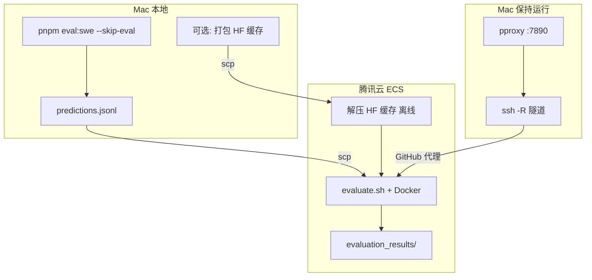
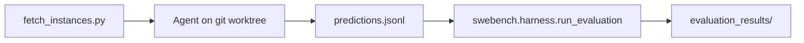

# SWE-bench 评测

用 [SWE-bench](https://github.com/SWE-bench/SWE-bench) 真实开源仓库做**最终验证**：本 harness 负责 agent 推理并生成 patch，官方 Docker harness 在隔离环境里跑测试判定是否 resolved。

推荐分工：**Mac 跑 Agent**，**国内云（腾讯云等）跑 Docker 评测**。

---

## 完整一次评测流程（端到端）

### 总览



| 阶段 | 在哪里 | 产出 | 耗时量级 |
|------|--------|------|----------|
| 1. 拉任务 + Agent | Mac | `predictions.jsonl` | 每条数分钟～数十分钟 |
| 2. 传文件 | Mac → 云 | 云上 `predictions.jsonl` | 秒级 |
| 3. Docker 评测 | 云 | `evaluation_results/<run-id>/` | 每条数十分钟～数小时（首次更久） |

**不要混淆：**

- `eval:swe --skip-eval` = 只「做题」（生成 patch），**不是** SWE-bench 评分。
- `evaluate.sh` = 「阅卷」（容器里跑测试），看 **resolved** 才算通过。

---

### 0. 仓库与目录

SWE-bench 评测在 **Forgelet monorepo**（本仓库 `coding-agent-chat-oss`）内，与桌面端、harness 共用同一 git 仓库：

```text
coding-agent-chat-oss/                 # 仓库根（在此执行 pnpm install / eval:swe）
├── packages/harness/
│   ├── eval/
│   │   ├── tasks/                       # 内置合成任务（日常迭代）
│   │   └── swe-bench/                   # SWE-bench 真实仓库评测（本文档）
│   │       ├── run.ts                   # Agent + 可选云端评测入口
│   │       ├── evaluate.sh              # 官方 Docker harness（多在云上执行）
│   │       ├── runs/eval-<run-id>/      # Agent 产出（gitignore）
│   │       └── repos/                   # 真实仓库 bare clone 缓存（gitignore）
│   └── src/                             # harness 引擎与工具
└── .env                                 # 建议放 DEEPSEEK_API_KEY（勿提交）
```

以下命令均在 **仓库根目录** 执行（`pnpm --filter @forgelet/harness ...`）；路径如 `packages/harness/eval/swe-bench/...` 均相对仓库根。

**Cursor Agent：** 可用项目 skill [`.cursor/skills/swe-bench-eval`](../../../../.cursor/skills/swe-bench-eval/SKILL.md) 按步骤自动化 Mac Agent + 云端评测（对话中说「跑 SWE-bench 评测」即可触发）。

---

### 1. 一次性准备（Mac）

```bash
# 仓库根
pnpm install

# API Key 建议放 .env，不要写在命令行
export DEEPSEEK_API_KEY=sk-...

# 拉任务用 Python（二选一）
cd packages/harness/eval/swe-bench
python3 -m venv .venv          # 或 .venv-mac
.venv/bin/pip install datasets huggingface_hub

# 验证能拉到 Lite（注意数据集名，不要用 princeton-nlp/...）
export HF_ENDPOINT=https://hf-mirror.com   # 国内 Mac 建议
.venv/bin/python -c "
from datasets import load_dataset
ds = load_dataset('SWE-bench/SWE-bench_Lite', split='test')
print('rows', len(ds))
"
# 应输出 rows 300
```

可选：打包 HuggingFace 缓存供云主机离线使用（云无法访问 HF 时必需）：

```bash
COPYFILE_DISABLE=1 tar czf ~/hf-cache.tar.gz -C ~/.cache huggingface
```

---

### 2. 一次性准备（腾讯云 ECS）

**推荐规格：** Ubuntu 24.04 x86_64 · 8C16G · 系统盘 ≥150GB · 公网 IP · 安全组放行 TCP:22（不必开 80/443）。

#### 2.1 安装 Docker + 镜像加速

```bash
sudo apt-get update
sudo apt-get install -y docker.io git python3 python3-venv python3-pip
sudo systemctl enable --now docker
sudo usermod -aG docker ubuntu
# 重新登录 SSH

sudo mkdir -p /etc/docker
sudo tee /etc/docker/daemon.json <<'EOF'
{
  "registry-mirrors": ["https://mirror.ccs.tencentyun.com"]
}
EOF
sudo systemctl restart docker
docker run --rm hello-world
```

#### 2.2 评测目录与 Python 依赖

```bash
mkdir -p ~/forgelet-eval && cd ~/forgelet-eval
# 从 Mac scp 整个 swe-bench 脚本目录，或 git clone 后拷贝
python3 -m venv .venv
.venv/bin/pip install -r requirements.txt
chmod +x evaluate.sh fetch_instances.py
```

#### 2.3 上传 HF 缓存（Mac → 云）

```bash
# Mac
scp ~/hf-cache.tar.gz ubuntu@<ECS_IP>:~/

# 云
mkdir -p ~/.cache
tar xzf ~/hf-cache.tar.gz -C ~/.cache
# tar 的 LIBARCHIVE.xattr... 警告可忽略（Mac 打包附带扩展属性）
```

#### 2.4 GitHub 代理（云无法访问 raw.githubusercontent.com 时必需）

公司内网 Mac 能访问 GitHub，但**没有** Clash 等本地代理时：在 Mac 起临时 HTTP 代理，经 SSH 反向隧道给云用。

**终端 A（Mac，保持运行）— 代理：**

```bash
python3 -m pip install --user pproxy
python3 -m pproxy -l http://127.0.0.1:7890

# 另开终端验证
curl -I --proxy http://127.0.0.1:7890 https://raw.githubusercontent.com
# 应看到 HTTP/1.1 200 Connection established
```

**终端 B（Mac，保持运行）— 隧道：**

```bash
ssh -N -o ServerAliveInterval=60 -R 7890:127.0.0.1:7890 ubuntu@<ECS_IP>
```

**云终端验证：**

```bash
curl -I --proxy http://127.0.0.1:7890 https://raw.githubusercontent.com
```

**Docker 也走代理（建议）：**

```bash
sudo mkdir -p /etc/systemd/system/docker.service.d
sudo tee /etc/systemd/system/docker.service.d/http-proxy.conf <<'EOF'
[Service]
Environment="HTTP_PROXY=http://127.0.0.1:7890"
Environment="HTTPS_PROXY=http://127.0.0.1:7890"
Environment="NO_PROXY=localhost,127.0.0.1,mirror.ccs.tencentyun.com"
EOF
sudo systemctl daemon-reload
sudo systemctl restart docker
```

评测期间 **终端 A、B 不要关**。

#### 2.5 环境自检（gold patch）

```bash
export http_proxy=http://127.0.0.1:7890
export https_proxy=http://127.0.0.1:7890
export HTTP_PROXY=http://127.0.0.1:7890
export HTTPS_PROXY=http://127.0.0.1:7890
export NO_PROXY=localhost,127.0.0.1,mirror.ccs.tencentyun.com

export HF_HOME=$HOME/.cache/huggingface
export HF_DATASETS_CACHE=$HOME/.cache/huggingface/datasets
export HF_HUB_OFFLINE=1
export HF_DATASETS_OFFLINE=1

cd ~/forgelet-eval
export SWEBENCH_PYTHON=$HOME/forgelet-eval/.venv/bin/python
bash evaluate.sh gold SWE-bench/SWE-bench_Lite validate-gold 1
```

进度条在 `0/300` 或 `0/1` 停很久**可能正常**（首条在构建镜像+跑测试）；用 `docker ps` 确认有容器在跑。

---

### 3. 每次正式评测

#### 3.1 Mac：跑 Agent（生成 patch）

在 **仓库根目录**（`coding-agent-chat-oss/`）：

```bash
cd /path/to/coding-agent-chat-oss
pnpm install

# API Key 可从 .env 读取后 export，或:
export DEEPSEEK_API_KEY=sk-...
export SWEBENCH_PYTHON="$(pwd)/packages/harness/eval/swe-bench/.venv/bin/python"
# 临时 venv 也可用 .venv-mac/bin/python

pnpm --filter @forgelet/harness eval:swe -- \
  --dataset lite \
  --limit 3 \
  --skip-eval \
  --run-id tencent-smoke
```

| 参数 | 含义 |
|------|------|
| `--limit 3` | 只跑 3 条（省略则拉满 Lite 300 条） |
| `--skip-eval` | 不在本机跑 Docker，只写 `predictions.jsonl` |
| `--run-id` | 输出目录 `runs/eval-<run-id>/` |

成功时类似：

```text
[OK] astropy__astropy-12907 (... patch 503 chars)
Patches: 3/3 non-empty
Skipped harness. Run verification: ...
```

产物：

```text
packages/harness/eval/swe-bench/runs/eval-tencent-smoke/
  instances.json
  predictions.jsonl    ← 上传云端
  run-report.json
  repos/               ← 本地 git 缓存，不必上传
```

断点续跑：

```bash
pnpm --filter @forgelet/harness eval:swe -- \
  --output packages/harness/eval/swe-bench/runs/eval-tencent-smoke \
  --instances packages/harness/eval/swe-bench/runs/eval-tencent-smoke/instances.json \
  --resume --skip-eval
```

#### 3.2 Mac → 云：上传 predictions

```bash
scp packages/harness/eval/swe-bench/runs/eval-tencent-smoke/predictions.jsonl \
  ubuntu@<ECS_IP>:~/forgelet-eval/predictions.jsonl
```

#### 3.3 云：Docker 官方评测

确认 **pproxy + ssh -R** 仍在 Mac 上运行，然后：

```bash
export http_proxy=http://127.0.0.1:7890
export https_proxy=http://127.0.0.1:7890
export HTTP_PROXY=http://127.0.0.1:7890
export HTTPS_PROXY=http://127.0.0.1:7890
export NO_PROXY=localhost,127.0.0.1,mirror.ccs.tencentyun.com

export HF_HOME=$HOME/.cache/huggingface
export HF_HUB_OFFLINE=1
export HF_DATASETS_OFFLINE=1

cd ~/forgelet-eval
export SWEBENCH_PYTHON=$HOME/forgelet-eval/.venv/bin/python

bash evaluate.sh \
  ~/forgelet-eval/predictions.jsonl \
  SWE-bench/SWE-bench_Lite \
  tencent-smoke \
  1
```

- 第 4 个参数 `1` = `max_workers`（建议先 1，稳定后再 4）。
- 进度 `0/3` 停 30～60 分钟可能正常；完成后变为 `1/3`、`2/3`、`3/3`。

#### 3.4 查看结果

```bash
cat ~/forgelet-eval/evaluation_results/tencent-smoke/results.json
# 或拉回 Mac
scp -r ubuntu@<ECS_IP>:~/forgelet-eval/evaluation_results/tencent-smoke ./
```

关注 **resolved**（测试通过、issue 算修好的比例）。

---

### 4. 日常速查表

| 步骤 | 位置 | 命令 |
|------|------|------|
| Agent | Mac（仓库根） | `pnpm --filter @forgelet/harness eval:swe -- --skip-eval --run-id <id> [--limit N]` |
| 传 patch | Mac | `scp packages/harness/eval/swe-bench/runs/eval-<id>/predictions.jsonl ubuntu@<IP>:~/forgelet-eval/` |
| 开代理 | Mac | `pproxy` + `ssh -R 7890:127.0.0.1:7890` |
| 评测 | 云 | `bash evaluate.sh predictions.jsonl SWE-bench/SWE-bench_Lite <run-id> 1` |
| 看分 | 云 | `evaluation_results/<run-id>/results.json` |

---

### 5. 常见问题

| 现象 | 原因 | 处理 |
|------|------|------|
| `princeton-nlp/SWE-bench_Lite` 拉取失败 | 旧数据集 ID，应用 `SWE-bench/SWE-bench_Lite` | 见上文 |
| 云 HF `Network is unreachable` | 云访问不了 HuggingFace | Mac 打包 `~/.cache/huggingface` + `HF_*_OFFLINE=1` |
| 云 GitHub `raw.githubusercontent.com` 失败 | 国内云常见 | Mac `pproxy` + `ssh -R`，并配置 Docker 代理 |
| Mac `127.0.0.1:7890` 连不上 | 没有 Clash，公司直连 GitHub | 用 `pproxy`，不是开 Clash 端口 |
| 只跑了 3 条 | 命令行有 `--limit 3` | 去掉或改大 |
| `readFile(...).trim is not a function` | 已修复 | 拉最新 `runner.ts` |
| `.venv/bin/python ENOENT` | 未建 venv | `eval:swe:setup` 或设 `SWEBENCH_PYTHON` |
| 评测 `0/3` 很久不动 | 首条 Docker+测试很慢 | `docker ps` 看是否在跑；首条完才涨进度 |
| tar `LIBARCHIVE.xattr` 警告 | Mac 打包属性 | 可忽略；用 `COPYFILE_DISABLE=1 tar` 可减少 |

**数据集名（评测 `--dataset_name`）：** 使用 `SWE-bench/SWE-bench_Lite`，不要用 `princeton-nlp/...`（`load_dataset` 会失败）。

---

## 架构说明



1. **拉取任务**：HuggingFace `SWE-bench/SWE-bench_Lite`（或 Verified / Full）
2. **Agent 修复**：`base_commit` worktree 上跑 harness，`git diff` → patch
3. **官方评测**：Docker 内应用 patch 并跑项目测试

## 环境准备（摘要）

### Agent（Node，Mac）

```bash
pnpm install
export DEEPSEEK_API_KEY=sk-...
```

### 评测（Python + Docker，云）

```bash
cd packages/harness/eval/swe-bench
python3 -m venv .venv && .venv/bin/pip install -r requirements.txt
# 或: pnpm --filter @forgelet/harness eval:swe:setup
```

资源建议（SWE-bench 官方）：x86_64 · ≥120GB 磁盘 · 16GB RAM。

## CLI 参数

| 参数 | 说明 |
|------|------|
| `--dataset` | `lite`（默认）、`verified`、`full` |
| `--limit` | 最多跑几条 instance |
| `--instance-ids` | 逗号分隔 |
| `--instances` | 本地 JSON，跳过 HF 拉取 |
| `--max-turns` | Agent 最大轮次（默认 75） |
| `--timeout-s` | 单条超时秒（默认 1800） |
| `--skip-eval` | 只生成 predictions |
| `--resume` | 跳过 predictions.jsonl 已有行 |
| `--run-id` | 目录 `runs/eval-<run-id>` |

环境变量：`DEEPSEEK_API_KEY`、`SWEBENCH_PYTHON`。

## 输出目录

```text
runs/eval-<run-id>/
  instances.json
  predictions.jsonl
  run-report.json
  worktrees/          # 临时，运行中
  repos/              # bare clone 缓存

evaluation_results/<run-id>/   # 云上 evaluate.sh
logs/                          # 云上 harness 日志
```

## predictions 格式

```json
{
  "instance_id": "sympy__sympy-20590",
  "model_name_or_path": "deepseek-v4-pro",
  "model_patch": "diff --git a/..."
}
```

## 与内置 eval 的关系

| | `eval/tasks/*` | SWE-bench |
|--|----------------|-----------|
| 代码库 | 小型合成 workspace | 真实 GitHub 仓库 |
| 判定 | `judge.sh` | Docker + 项目测试 |
| 用途 | 日常迭代 | **发版 / 对比模型** |

日常：`pnpm --filter @forgelet/harness eval`  
发版前：SWE-bench Lite 子集 + 云端 `evaluate.sh`。

## 脚本命令

```bash
pnpm --filter @forgelet/harness eval:swe          # Agent（可加 --skip-eval）
pnpm --filter @forgelet/harness eval:swe:verify   # 仅 Docker 评测
pnpm --filter @forgelet/harness eval:swe:setup    # 云/Macos 上装 Python 依赖
```

## 验证 gold patch

```bash
bash evaluate.sh gold SWE-bench/SWE-bench_Lite validate-gold 1
```

`predictions_path` 为字面量 `gold` 时使用数据集标准答案 patch。
