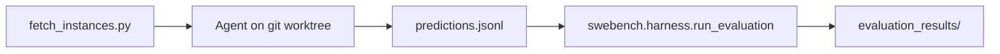

# SWE-bench 评测

用 [SWE-bench](https://github.com/SWE-bench/SWE-bench) 真实开源仓库做**最终验证**：本 harness 负责 agent 推理并生成 patch，官方 Docker harness 负责在隔离环境里跑测试判定是否 resolved。

## 流程



1. **拉取任务**：从 HuggingFace 导出 instance（`problem_statement` + `base_commit` + `repo`）
2. **Agent 修复**：在 `base_commit` 的 worktree 里跑 `@forgelet/harness` agent，收集 `git diff`
3. **官方评测**：`predictions.jsonl` 交给 `swebench.harness.run_evaluation`（需 Docker）

## 环境准备

### Agent 阶段（Node）

```bash
# 仓库根目录
pnpm install
export DEEPSEEK_API_KEY=sk-...
```

### 评测阶段（Python + Docker）

```bash
cd packages/harness/eval/swe-bench
python3 -m venv .venv
.venv/bin/pip install -r requirements.txt

# 安装并启动 Docker（见 SWE-bench 文档）
# macOS Apple Silicon 评测时需本地构建镜像，verify 脚本会自动加 --namespace ''
```

资源建议（来自 SWE-bench 文档）：x86_64、约 120GB 磁盘、16GB RAM；`--max-workers` 按机器调整。

> **Mac 用户**：本机磁盘/ARM 往往不适合跑完整 Docker 评测，推荐下面「阿里云」流程——Agent 留本地，评测上云。

## 阿里云：本地 Agent + 云端评测

Harness agent 在**本地 Mac** 跑；**阿里云 ECS** 只负责 Docker 官方评测。两边通过 `predictions.jsonl` 衔接，无需上传 `repos/`、`worktrees/`。

```text
┌─────────────────────────────┐         ┌──────────────────────────────┐
│  本地 Mac                    │  scp   │  阿里云 ECS（Ubuntu x86_64）  │
│  pnpm eval:swe --skip-eval  │ ──────► │  evaluate.sh / eval:swe:verify│
│    → predictions.jsonl      │         │    → evaluation_results/     │
└─────────────────────────────┘         └──────────────────────────────┘
```

| 阶段 | 机器 | 需要什么 |
|------|------|----------|
| 拉任务 + Agent | 本地 | Node/pnpm、`DEEPSEEK_API_KEY`、git；**不必** Docker |
| 官方评测 | 阿里云 | Docker、Python venv + `swebench`；**不必** API Key |

云上 harness 会按 `instance_id` 在容器内准备对应 repo 与 `base_commit`，再应用你提交的 `model_patch`，与本地 worktree 无关。

### 1. 本地：跑 Agent（`--skip-eval`）

```bash
# 仓库根目录
pnpm install
export DEEPSEEK_API_KEY=sk-...

# 仅拉 instance 列表（小 venv，非 Docker）
cd packages/harness/eval/swe-bench
python3 -m venv .venv
.venv/bin/pip install datasets huggingface_hub

# 回到仓库根，跑 agent
pnpm --filter @forgelet/harness eval:swe -- \
  --dataset lite \
  --limit 10 \
  --skip-eval \
  --run-id local-lite-10
```

产物：`packages/harness/eval/swe-bench/runs/eval-local-lite-10/predictions.jsonl`（**需上传**）。

断点续跑：同一 `--output` 目录加 `--resume --skip-eval`。

### 2. 阿里云：开 ECS

| 项 | 建议 |
|----|------|
| 镜像 | Ubuntu 22.04 / 24.04，**x86_64** |
| 规格 | 8 vCPU、16GB 内存 |
| 系统盘 | **≥ 150GB** |
| 安全组 | 放行 **22**（SSH） |
| 网络 | 可访问公网（拉 Docker 镜像） |

### 3. 阿里云：装 Docker + 评测环境

SSH 登录后（示例）：

```bash
# 安装 Docker（按 Ubuntu / 阿里云文档安装 docker.io 或 Docker CE）
sudo apt-get update
sudo apt-get install -y docker.io
sudo usermod -aG docker $USER
# 退出 SSH 重新登录，使 docker 组生效

mkdir -p ~/forgelet-eval && cd ~/forgelet-eval
```

将评测所需文件放到 ECS（任选其一）：

- **最小**：`scp` 本仓库的 `packages/harness/eval/swe-bench/` 下  
  `evaluate.sh`、`requirements.txt`，以及 `.venv` 在云上自行 `pip install`
- **完整**：`git clone` 整个仓库，`cd packages/harness/eval/swe-bench`

```bash
cd ~/forgelet-eval   # 或 clone 后的 swe-bench 目录
python3 -m venv .venv
.venv/bin/pip install -r requirements.txt
```

云上**不需要** Node、pnpm，也**不要**配置 `DEEPSEEK_API_KEY`。

### 4. 上传 predictions（Mac → ECS）

在**本地**执行（将 `<ECS_IP>` 换成公网 IP）：

```bash
scp packages/harness/eval/swe-bench/runs/eval-local-lite-10/predictions.jsonl \
  user@<ECS_IP>:~/forgelet-eval/predictions.jsonl
```

也可用 `rsync`、OSS 等；传的是文本 JSONL，不含密钥。

### 5. 阿里云：跑官方 harness

SSH 到 ECS：

```bash
cd ~/forgelet-eval
export SWEBENCH_PYTHON=$PWD/.venv/bin/python

bash evaluate.sh \
  ~/forgelet-eval/predictions.jsonl \
  princeton-nlp/SWE-bench_Lite \
  aliyun-lite-10 \
  4
```

若已 `git clone` 完整仓库，也可：

```bash
pnpm --filter @forgelet/harness eval:swe:verify -- \
  ~/forgelet-eval/predictions.jsonl \
  --dataset lite \
  --run-id aliyun-lite-10 \
  --max-workers 4
```

结果目录：`evaluation_results/aliyun-lite-10/`。需要时在 ECS 上打包 `scp` 回本地查看 `results.json`。

### 日常流程速查

| 步骤 | 位置 | 命令 |
|------|------|------|
| 1 | Mac | `eval:swe -- --skip-eval --run-id <id>` |
| 2 | Mac → ECS | `scp .../predictions.jsonl user@<IP>:~/forgelet-eval/` |
| 3 | ECS | `bash evaluate.sh predictions.jsonl princeton-nlp/SWE-bench_Lite <run-id> 4` |
| 4 | 可选 | `scp` 拉回 `evaluation_results/` |

### 常见问题

- **本地 clone 和云上仓库一致吗？**  
  不必一致。评测在 SWE-bench 预制 Docker 环境内进行，只认 `instance_id` + `model_patch`。

- **为什么 Mac 不推荐本地 Docker 评测？**  
  Apple Silicon 需本地构建 Linux 镜像；SWE-bench 镜像缓存常需 **100GB+** 磁盘，多数 Mac 可用空间不足。

- **ECS 在国内拉镜像慢？**  
  可配置 Docker 镜像加速，或降低 `--cache_level`（更省盘、更慢）。首次评测会拉取较多镜像。

- **费用？**  
  按量 8C16G + 大系统盘，跑 Lite 子集通常为几小时量级；测完可关机或释放实例。

## 快速开始

### 冒烟（3 条 Lite）

```bash
pnpm --filter @forgelet/harness eval:swe -- --dataset lite --limit 3 --skip-eval
```

仅生成 patch，不跑 Docker：

```bash
# 之后单独验证
pnpm --filter @forgelet/harness eval:swe:verify -- \
  packages/harness/eval/swe-bench/runs/eval-<timestamp>/predictions.jsonl \
  --dataset lite
```

### 完整流程（agent + Docker 评测）

```bash
pnpm --filter @forgelet/harness eval:swe -- \
  --dataset lite \
  --limit 10 \
  --run-id forgelet-lite-10
```

### 指定 instance

```bash
pnpm --filter @forgelet/harness eval:swe -- \
  --instance-ids sympy__sympy-20590,astropy__astropy-12907 \
  --skip-eval
```

### 断点续跑

```bash
pnpm --filter @forgelet/harness eval:swe -- \
  --output packages/harness/eval/swe-bench/runs/eval-123 \
  --instances packages/harness/eval/swe-bench/runs/eval-123/instances.json \
  --resume \
  --skip-eval
```

## CLI 参数

| 参数 | 说明 |
|------|------|
| `--dataset` | `lite`（默认）、`verified`、`full` |
| `--limit` | 最多跑几条 |
| `--instance-ids` | 逗号分隔的 instance_id |
| `--instances` | 本地 JSON/JSONL，跳过 HF 拉取 |
| `--max-turns` | Agent 最大轮次（默认 75） |
| `--timeout-s` | 单条超时秒数（默认 1800） |
| `--skip-eval` | 只生成 predictions，不跑 Docker |
| `--resume` | 跳过 predictions.jsonl 里已有的 instance |
| `--run-id` | 运行目录名 `runs/eval-<run-id>` |
| `--evaluate-only` | 仅跑官方 harness（需已有 predictions） |

环境变量：`DEEPSEEK_API_KEY`、`SWEBENCH_PYTHON`（非默认 venv 的 python 路径）。

## 输出目录

```
runs/eval-<run-id>/
  instances.json      # 本次任务列表
  predictions.jsonl   # 官方格式，供 harness 消费
  run-report.json       # agent 运行摘要
  worktrees/            # 临时 git worktree（运行中）
```

官方 harness 日志与结果：

- `eval/swe-bench/logs/`
- `eval/swe-bench/evaluation_results/<run-id>/`

## predictions 格式

每行一条 JSON（与 SWE-bench 文档一致）：

```json
{
  "instance_id": "sympy__sympy-20590",
  "model_name_or_path": "deepseek-v4-pro",
  "model_patch": "diff --git a/..."
}
```

## 与内置 eval 的关系

| | `eval/tasks/*` | SWE-bench |
|--|----------------|-----------|
| 代码库 | 小型合成 workspace | 真实 GitHub 仓库 |
| 判定 | `judge.sh` / 本地脚本 | Docker + 项目测试套件 |
| 用途 | 开发迭代、能力分层 | **最终能力验证** |

建议：日常改 agent 用 `pnpm --filter @forgelet/harness eval`；发版或对比模型前跑 SWE-bench Lite 子集。

## 验证 gold patch（环境自检）

```bash
cd packages/harness/eval/swe-bench
./evaluate.sh gold princeton-nlp/SWE-bench_Lite validate-gold 1 ''
```

（`predictions_path` 为字面量 `gold` 时使用数据集金标准 patch。）
