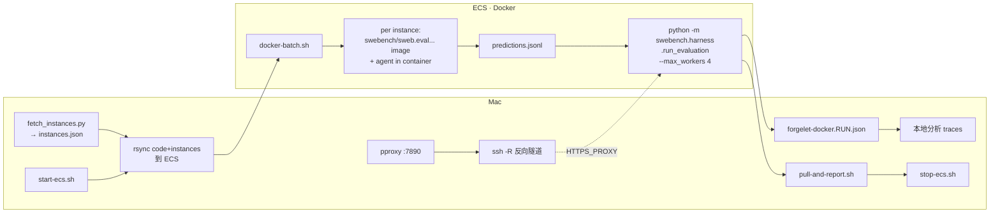

# SWE-bench 端到端工作流

**最终方案**：Mac 准备题集 + 跑 pproxy → **按需开机 ECS** → ECS 跑 **agent in instance Docker**（self-verify）+ **ECS 跑官方 swebench harness 评分**（走代理拉 GitHub）→ 拉报告回 Mac → **API 关机省云费**。

> 💡 **省钱**：ECS 按量计费空转约 **1–2 元/小时**。用 `start-ecs.sh` / `stop-ecs.sh`（腾讯云 `StopInstances` API）只在跑 batch 期间开机，详见 **§0.3**。

> ⚠️ **不再用 sb-cli**：经实测 `sb-cli submit swe-bench_lite test/dev` 后端整套全是 `0/N resolved`，**连 gold patch 都 100% failed**。这工具对 swe-bench_lite 不可用，会浪费配额（详见 §4）。



| 阶段 | 在哪 | 工具 |
|------|------|------|
| **开机** | Mac | `start-ecs.sh --wait` 或 `pnpm eval:ecs:start`（腾讯云 API） |
| 拉题集 | Mac | `fetch_instances.py`（一次性 venv） |
| 跑 agent + self-verify | **ECS Docker** | `docker-batch.sh` 调 instance image，agent 在 `/testbed` 直接跑 pytest |
| 开代理（让 ECS 能访问 GitHub） | Mac | `pproxy :7890` + `ssh -R 7890:127.0.0.1:7890` |
| **评分** | **ECS** | `python -m swebench.harness.run_evaluation --max_workers 4` |
| 调试单题 | ECS Docker | `docker-smoke.sh <id>`（流式 stdout，`--no-trace`） |
| **根因深挖（开 trace）** | ECS Docker | `docker-trace-rerun.sh <id> 3` → JSONL 在 `~/.forgelet/traces/...` |
| 拉日志+生成成本报告 | Mac | `pull-and-report.sh <run-id>` → 生成 `cost-report.{tsv,md}` |
| **关机** | Mac | `pull-and-report.sh … --stop` 或 `stop-ecs.sh --wait`（`STOP_CHARGING`） |
| 看 agent 终端 log | Mac | `~/.forgelet/runs/swe-bench/<run-id>/logs/<id>/agent.log` |
| 看逐步 trace | Mac | `pnpm eval:swe:traces -- --run-id <id>`（仅 trace 重跑后有） |

### 轨迹日志位置

- **运行时（ECS）**：`~/swe-batch/<run-id>/logs/<id>/agent.log`（docker 容器内 stdout/stderr 落到这里）
- **同步后（Mac）**：`~/.forgelet/runs/swe-bench/<run-id>/logs/<id>/agent.log`（由 `pull-and-report.sh` rsync 回来）
- 每题三件套：`agent.log`（终端回放）、`agent.patch`（diff）、`prompt.txt`（题目）

### Trace：`--no-trace` 与 JSONL（批量 vs 根因）

| 场景 | CLI 标志 | 产出 |
|------|----------|------|
| **`docker-batch.sh` 打分 batch** | **必须** `--no-trace` | 只有 `agent.log`；50 题 JSONL 体积/IO 不划算 |
| **`docker-smoke.sh` 默认** | `--no-trace` | 同上，快速看 stdout |
| **诡异题根因分析** | 去掉 `--no-trace`（`FORGELET_SAVE_TRACE=1`） | `~/.forgelet/traces/swe-bench/eval-<runId>/instances/<id>.jsonl` |

`docker-batch.sh` / 默认 `docker-smoke.sh` **已经带 `--no-trace`**——batch 并没有误开 trace。  
要对比工具调用逐步事件，用 **`docker-trace-rerun.sh`**（见 §2.1），**定锤 root cause 之前不要改 agent 逻辑**。

Mac 上 `pnpm eval:swe` 默认**开** trace；ECS Docker 路径默认**关** trace，二者不要混用同一套预期。

`docker-batch.sh` 结束时会自动调一次 `cost-report.py`，在 `<run-id>/cost-report.tsv` 和 `cost-report.md` 写入每题的 instance_id / cost / turns / 耗时 / 评测结果 / 日志路径。Mac 侧再跑一次 `pull-and-report.sh` 既同步日志又重算一份（评测完成后 eval-report.json 会加入评测列）。

> **为什么 agent 必须在 docker 里**：SWE-bench 题目的 fix 几乎都需要跑 pytest 验证。Mac 本地 worktree 没有 python 依赖 + 测试套件配置，agent 只能盲改，基线分会 < 10%。在 instance image 里 agent 能直接 `conda activate testbed && pytest`。
>
> **为什么评分要在 ECS 跑**：swebench harness 每题要拉 `requirements.txt` from GitHub。ECS docker pull 走腾讯镜像，但公网 HTTPS 出口被防火墙挡，所以靠 Mac 起 pproxy + `ssh -R` 反向隧道让 ECS 能访问 GitHub。整套跑 50 题约 30-60 min（image 已缓存的话）。

---

## 0. 一次性准备

### 0.1 Mac

| 任务 | 命令 |
|------|------|
| Forgelet 依赖 | `pnpm install` |
| 数据集 venv | `pnpm eval:swe:setup` |
| **pproxy**（让 ECS 走 Mac 出口访问 GitHub） | `python3 -m pip install --user pproxy` |
| `.env` | `DEEPSEEK_API_KEY=...` 放仓库根，自动被 batch 透传到 container |
| **tccli**（ECS 开关机） | `python3 -m pip install --user tccli`（`start-ecs.sh` / `stop-ecs.sh` 会自动找 `~/Library/Python/*/bin/tccli`，不必手动改 PATH） |
| **腾讯云 API 密钥** | 仓库根 `.env` 加 `TENCENTCLOUD_SECRET_ID` / `TENCENTCLOUD_SECRET_KEY`（[CAM 控制台](https://console.cloud.tencent.com/cam/capi)） |
| **ECS 标识** | `.env` 加 `TENCENT_ECS_REGION`（如 `ap-guangzhou`）+ `TENCENT_ECS_INSTANCE_ID`（`ins-…`）或 `ECS_IP`（自动查 id） |

### 0.2 ECS（首次配 / 换机时）

| 任务 | 命令 |
|------|------|
| ssh 公钥免密 | 把本地 `~/.ssh/id_*.pub` 加到 ECS 的 `~/.ssh/authorized_keys` |
| Docker | 标配（绝大多数云镜像自带），daemon.json 配腾讯 mirror `https://mirror.ccs.tencentyun.com` |
| Node 20（不能跟 host 共享 .so） | `mkdir ~/node-prebuilt && wget -qO- https://nodejs.org/dist/v20.18.0/node-v20.18.0-linux-x64.tar.xz \| tar -xJ -C ~/node-prebuilt && mv ~/node-prebuilt/node-* ~/node-prebuilt/node-v20` |
| pnpm | `sudo apt install -y npm && sudo npm i -g pnpm@9` |
| **sweb-venv**（官方评测 harness） | `python3 -m venv ~/sweb-venv && ~/sweb-venv/bin/pip install 'swebench>=4.1.0' datasets huggingface_hub` |
| sync 代码 | `rsync -avz --exclude node_modules --exclude .git ./ ubuntu@$ECS_IP:~/coding-agent-chat-oss/` |
| 装依赖 + build | `ssh ubuntu@$ECS_IP 'cd ~/coding-agent-chat-oss && ELECTRON_SKIP_BINARY_DOWNLOAD=1 pnpm install && pnpm --filter @forgelet/sdk-runtime build'` |
| `.env` | `scp .env ubuntu@$ECS_IP:~/coding-agent-chat-oss/.env`（含 `DEEPSEEK_API_KEY`） |
| 预热 HF dataset 缓存（首次，需代理） | `ssh ubuntu@$ECS_IP 'env https_proxy=http://127.0.0.1:7890 ~/sweb-venv/bin/python -c "from datasets import load_dataset; load_dataset(\"SWE-bench/SWE-bench_Lite\", split=\"test\")"'` |

### 0.3 腾讯云 ECS 开关机（推荐 · 省钱）

脚本在 `packages/harness/eval/`，通过官方 [StopInstances / StartInstances](https://cloud.tencent.com/document/product/213/15743) API 控制 CVM。**在 Mac 上调用**（不要把 SecretKey 放到 ECS 上）。

**`.env` 示例**（见仓库根 `.env.example`）：

```bash
TENCENTCLOUD_SECRET_ID=AKID...
TENCENTCLOUD_SECRET_KEY=...
TENCENT_ECS_REGION=ap-guangzhou
TENCENT_ECS_INSTANCE_ID=ins-xxxxxxxx   # 控制台可见；省略则用 ECS_IP 自动查
ECS_IP=119.91.220.67
```

| 命令 | 作用 |
|------|------|
| `./packages/harness/eval/start-ecs.sh --wait` | 开机并等到 `RUNNING` |
| `./packages/harness/eval/stop-ecs.sh --wait` | 软关机 + `STOP_CHARGING`（按量停 CPU/RAM 计费） |
| `pnpm --filter @forgelet/harness eval:ecs:start` | 同上（包装 `--wait`） |
| `pnpm --filter @forgelet/harness eval:ecs:stop` | 同上 |

**推荐节奏**（空转时不计费）：

```bash
# 跑 batch 前
pnpm --filter @forgelet/harness eval:ecs:start
# … sync → docker-batch → eval …
# 全部拉完后
./packages/harness/eval/swe-bench/pull-and-report.sh lite-50 --stop --wait-stop
```

`--stop` 会在 rsync + 成本报告之后自动调 `stop-ecs.sh`。等价写法：`pull-and-stop.sh lite-50 --wait-stop`。

> 关机后**系统盘、弹性公网 IP 可能仍计费**（几元/天量级）。长期不用可考虑释放 EIP 或「快照 + 退还实例」。

---

## 1. 完整流程

### 1.1 拉题集（Mac，首次 / 换数据集）

```bash
mkdir -p ~/.forgelet/runs/swe-bench/lite-full
cd packages/harness/eval/swe-bench
.venv/bin/python fetch_instances.py \
  --dataset lite \
  --output ~/.forgelet/runs/swe-bench/lite-full/instances.json
# 300 条 instances.json
```

切片：

```bash
jq '.[0:50]' ~/.forgelet/runs/swe-bench/lite-full/instances.json \
  > ~/.forgelet/runs/swe-bench/lite-50/instances.json
```

### 1.2 同步到 ECS

```bash
export ECS_IP=119.91.220.67          # 改成你的（或写在 .env）

# 若实例已关机，先开机（§0.3）
pnpm --filter @forgelet/harness eval:ecs:start

# 同步切片好的 instances
ssh ubuntu@$ECS_IP 'mkdir -p ~/swe-batch'
rsync -avz ~/.forgelet/runs/swe-bench/lite-50/instances.json \
  ubuntu@$ECS_IP:~/swe-batch/

# 同步代码（改了 prompt / agent 逻辑就要重 sync + rebuild）
rsync -avz --exclude node_modules --exclude .git \
  ./ ubuntu@$ECS_IP:~/coding-agent-chat-oss/
ssh ubuntu@$ECS_IP 'cd ~/coding-agent-chat-oss && pnpm --filter @forgelet/sdk-runtime build'
```

> ⚠️ **`@forgelet/sdk-runtime` 的 `package.json` 是 `"main": "dist/index.js"`，sync 后必须 rebuild**——否则 `apps/cli` import 进来的还是旧 dist。同样道理任何 `packages/*` 改了 src 都要重 build。

### 1.3 在 ECS 跑 docker batch

```bash
ssh ubuntu@$ECS_IP 'cd ~/coding-agent-chat-oss && \
  cp packages/harness/eval/swe-bench/docker-batch.sh ~/docker-batch.sh && \
  chmod +x ~/docker-batch.sh'

# 启动（后台 + nohup，预计 2-3h）
ssh ubuntu@$ECS_IP 'nohup ~/docker-batch.sh ~/swe-batch/instances.json ~/swe-batch/lite-50 \
  > ~/swe-batch/lite-50.log 2>&1 </dev/null & echo "pid=$!"'

# 看进度
ssh ubuntu@$ECS_IP 'wc -l ~/swe-batch/lite-50/done.txt; tail -3 ~/swe-batch/lite-50/summary.tsv'
```

| 产出（ECS `~/swe-batch/lite-50/`） | 说明 |
|------------------------------------|------|
| `predictions.jsonl` | `{instance_id, model_name_or_path, model_patch}` 一行一题 |
| `summary.tsv` | `<id>\t<OK\|FAIL_PULL\|FAIL_RUN>\t<patch_lines>\t<elapsed_s>` |
| `done.txt` | 完成的 id 列表，重跑会 skip（resume-safe） |
| `logs/<id>/agent.log` | agent 实际 stdout（含工具调用 / pytest 输出） |
| `logs/<id>/agent.patch` | 容器内 `git diff` 的产物 |

**调参**（env vars）：

```bash
KEEP_IMAGES=20 PER_INSTANCE_TIMEOUT=900 MODEL_NAME=forgelet-docker-v2 \
  ~/docker-batch.sh ~/swe-batch/instances.json ~/swe-batch/lite-50
```

| 变量 | 默认 | 作用 |
|------|------|------|
| `KEEP_IMAGES` | 15 | LRU 保留最近 N 个 `swebench/sweb.eval.*` image（每个 ~4GB） |
| `PER_INSTANCE_TIMEOUT` | 600s | 单题超时（含 LLM 思考 + 工具调用） |
| `MODEL_NAME` | `forgelet-docker` | 写入 predictions.jsonl 的 `model_name_or_path` |

> `docker-batch.sh` 跑完会自动在 `~/swe-batch/<run-id>/` 写 `cost-report.tsv` + `cost-report.md`（per-instance 成本、turns、耗时、agent.log 路径）。此时还没评测结果，所以 `eval_status` 列为空；评测完成后再跑一次 1.4 即可补齐。

### 1.4 拉日志 + 成本报告回 Mac

```bash
# 任何时候都能跑（batch 跑完之后，或者评测完之后再跑一次拿 eval_status）：
./packages/harness/eval/swe-bench/pull-and-report.sh lite-50

# 拉完自动关机（推荐，§0.3）：
./packages/harness/eval/swe-bench/pull-and-report.sh lite-50 --stop --wait-stop

# 或自定义 ECS / 路径：
ECS_HOST=ubuntu@<ip> ECS_BATCH_ROOT='~/swe-batch' ./pull-and-report.sh lite-50 --stop
```

产物（落在 `~/.forgelet/runs/swe-bench/<run-id>/`）：

| 文件 | 内容 |
|------|------|
| `cost-report.tsv` | `instance_id\tbatch_status\teval_status\tcost_usd\tturns\tllm_s\twall_s\tpatch_lines\tagent_log` 一行一题 |
| `cost-report.md` | Markdown 汇总：totals + eval breakdown + per-instance 表 |
| `logs/<id>/agent.log` | 完整轨迹（rsync 自 ECS 的 `~/swe-batch/<run-id>/logs/<id>/agent.log`） |
| `logs/<id>/agent.patch` | agent 生成的 diff |
| `summary.tsv` / `predictions.jsonl` / `eval-report.json` | docker-batch + 官方 eval 原始输出 |

> ⚠️ **成本数字的真伪**：cost 来自 agent.log footer，由 `apps/cli/src/terminal.ts` 用 `cacheReadInputTokens` 算出。如果 ECS 的 `dist/` 比 `src/` 旧（没有 cache tracking），成本会被高估 ~4×（DeepSeek V4 Pro cache 命中率通常 80%+，cache-hit 价 $0.003625/M vs cache-miss $0.435/M，差 120×）。Sync 代码后**务必 rebuild**：`pnpm --filter @forgelet/harness build`。

### 1.5 起 pproxy + ssh 反向隧道（评测前必做）

ECS 跑官方 harness 时每题要从 GitHub 拉 `requirements.txt`，但 ECS 公网 HTTPS 出口被防火墙挡。Mac 起 pproxy 让 ECS 走 Mac 出口：

```bash
# Mac 终端 A：pproxy（保持后台运行，eval 全程不能关）
python3 -m pproxy -l http://127.0.0.1:7890 > /tmp/pproxy.log 2>&1 &
# 自检：HTTP 200 才算通
curl -s -o /dev/null -w "HTTP %{http_code}\n" --proxy http://127.0.0.1:7890 https://raw.githubusercontent.com

# Mac 终端 B：ssh 反向隧道（保持后台运行）
ssh -f -N -o ExitOnForwardFailure=yes -o ServerAliveInterval=60 \
  -R 7890:127.0.0.1:7890 ubuntu@$ECS_IP
# ECS 自检：HTTP 200 才算通
ssh ubuntu@$ECS_IP 'curl -s -o /dev/null -w "HTTP %{http_code}\n" --proxy http://127.0.0.1:7890 https://github.com'
```

> ⚠️ Mac 进入睡眠 / pproxy 被 kill / ssh 隧道断 → eval 必卡。整套 eval 期间 Mac 必须保持在线。

### 1.6 ECS 上跑官方评测

```bash
RUN_ID=lite-50-eval-v1  # 自己命名，区分不同 agent 版本
ssh ubuntu@$ECS_IP "rm -rf ~/logs/run_evaluation/$RUN_ID; \
  nohup env \
    http_proxy=http://127.0.0.1:7890 \
    https_proxy=http://127.0.0.1:7890 \
    HTTP_PROXY=http://127.0.0.1:7890 \
    HTTPS_PROXY=http://127.0.0.1:7890 \
    NO_PROXY=localhost,127.0.0.1,mirror.ccs.tencentyun.com \
    HF_HUB_OFFLINE=1 HF_DATASETS_OFFLINE=1 \
    ~/sweb-venv/bin/python -m swebench.harness.run_evaluation \
      --predictions_path ~/swe-batch/lite-50/predictions.jsonl \
      --dataset_name SWE-bench/SWE-bench_Lite \
      --run_id $RUN_ID \
      --max_workers 4 \
      --cache_level env \
    > ~/swe-batch/$RUN_ID.log 2>&1 </dev/null & echo \"pid=\$!\""
```

| 调参 | 默认建议 | 说明 |
|------|--------|------|
| `--max_workers` | **4** | 8 核 16 GB ECS 上 4 路并行最稳，CPU/RAM 都有余量 |
| `--cache_level` | **env** | 复用 `swebench/sweb.eval.*` 已缓存 image，不重 build |
| `--dataset_name` | `SWE-bench/SWE-bench_Lite` | 跟你 instances.json 来源对齐 |

预估总耗时：每题 pytest **~5-10 min**，46 题（50 题中扣 4 空 patch） / 4 并行 ≈ **30-60 min**。首次 image 拉取（如果没缓存）每题 +2-5 min。

### 1.6.1 增量 eval（只评补跑的 empty patch）

Agent batch 与 eval 都可以「只处理变更的题、再合入旧结果」——补跑 empty patch 时 **不必** 对全部 50 题重跑 harness。

```text
首次全量 eval:     29 resolved + 13 unresolved + 8 empty = 50
补跑 agent（8 题）:  predictions.jsonl 合入（见 docker-batch resume）
增量 eval（8 题）:   run_evaluation --instance_ids …  →  x/8
合入报告:           merge-eval-report.py  →  29+x / 50
```

**1. 只评 N 题（ECS）**

```bash
# Mac: pproxy + ssh -R（§1.5）后
ssh ubuntu@$ECS_IP '~/eval-partial.sh \
  ~/swe-batch/lite-51-100-rv1/predictions.jsonl \
  lite-51-100-rv1-eval-partial8 \
  django__django-15061 django__django-15202 django__django-15213 \
  django__django-15252 django__django-15320 django__django-15695 \
  django__django-15738 django__django-15781'

# 完成条件: report.json 数 == N（不是 50−empty）
ssh ubuntu@$ECS_IP 'find ~/logs/run_evaluation/lite-51-100-rv1-eval-partial8 -name report.json | wc -l'
```

**2. 拉回 partial 报告 + 合入 base**

```bash
PARTIAL_RUN=lite-51-100-rv1-eval-partial8
BASE_RUN=lite-51-100-rv1-eval-rerun8
MERGED_RUN=lite-51-100-rv1-eval-merged

mkdir -p ~/.forgelet/runs/swe-bench/{$PARTIAL_RUN,$MERGED_RUN}
scp ubuntu@$ECS_IP:~/forgelet-docker-rv1.$PARTIAL_RUN.json \
  ~/.forgelet/runs/swe-bench/$PARTIAL_RUN/eval-report.json

python3 packages/harness/eval/swe-bench/merge-eval-report.py \
  --base  ~/.forgelet/runs/swe-bench/$BASE_RUN/eval-report.json \
  --partial ~/.forgelet/runs/swe-bench/$PARTIAL_RUN/eval-report.json \
  --out   ~/.forgelet/runs/swe-bench/$MERGED_RUN/eval-report.json

# 让 cost-report 读到合并分：复制或 symlink 到 batch 目录
cp ~/.forgelet/runs/swe-bench/$MERGED_RUN/eval-report.json \
   ~/.forgelet/runs/swe-bench/lite-51-100-rv1/eval-report.json
python3 packages/harness/eval/swe-bench/cost-report.py \
  ~/.forgelet/runs/swe-bench/lite-51-100-rv1
```

| 监控口径 | 全量 eval | 增量 eval（8 empty 补完） |
|----------|-----------|---------------------------|
| harness 进度条 | `x/50` | `x/8` |
| `report.json` 数 | 50 − empty | **N**（补跑题数） |
| 合入后分数 | 同左（慢） | `base.resolved + partial.resolved` |

> 全量重评 50 题结果应与合入一致（未改 patch 的题 deterministic），但增量可省 **~80%** 阅卷时间。

### 1.7 监控进度

```bash
# 一行看全：进度条 + 当前 4 个并行容器 + 已完成数
ssh ubuntu@$ECS_IP 'echo "== progress =="; tail -1 ~/swe-batch/lite-50-eval-v1.log | tr "\r" "\n" | tail -1; \
  echo ""; echo "== running containers =="; docker ps --filter "name=sweb" --format "  {{.Names}}  ({{.Status}})"; \
  echo ""; echo "== completed =="; find ~/logs/run_evaluation/lite-50-eval-v1 -name report.json | wc -l; echo "of 46"'

# 实时 follow 日志（带 tqdm 进度条）
ssh ubuntu@$ECS_IP 'tail -f ~/swe-batch/lite-50-eval-v1.log'

# 评测进程是否还活着 + 已跑时间
ssh ubuntu@$ECS_IP 'ps -p $(pgrep -f swebench.harness.run_evaluation | head -1) -o etime=,stat= 2>/dev/null || echo "(no eval running)"'
```

### 1.8 拉评测报告回 Mac + 看分

> 拿到 `eval-report.json` 后回到 §1.4 再跑一次 `pull-and-report.sh`，`cost-report.tsv` 的 `eval_status` 列就会自动补齐 resolved/unresolved/empty/error。

```bash
RUN_ID=lite-50-eval-v1
mkdir -p ~/.forgelet/runs/swe-bench/$RUN_ID
scp ubuntu@$ECS_IP:~/forgelet-docker.$RUN_ID.json \
  ~/.forgelet/runs/swe-bench/$RUN_ID/eval-report.json

REP=~/.forgelet/runs/swe-bench/$RUN_ID/eval-report.json
jq '{submitted_instances, completed_instances, resolved_instances,
     unresolved_instances, empty_patch_instances, error_instances,
     resolved_rate: ((.resolved_instances/.submitted_instances*100)|tostring + "%")}' $REP
jq -r '.unresolved_ids[]' $REP   # 应用了但测试没全过 → patch 逻辑不对
jq -r '.empty_patch_ids[]' $REP  # agent 空 patch（放弃 / 卡死）
jq -r '.error_ids[]' $REP        # 评测基建出错（罕见）
```

| 字段 | 含义 |
|------|------|
| `submitted_instances` | 提交的条数（含 empty patches） |
| `completed_instances` | resolved + unresolved（patch apply 成功 + 测试有结果） |
| `resolved_instances` | **测试全过 ← 关键分数** |
| `unresolved_instances` | patch 应用了但 FAIL_TO_PASS 没全过（agent 推理错） |
| `empty_patch_instances` | predictions.jsonl 里 `model_patch:""`（agent 放弃 / 没完成） |
| `error_instances` | 评测基建出错（pytest crash / docker 异常） |
| `resolved_ids` / `unresolved_ids` / `failed_ids` / `error_ids` | per-instance ID 列表，用来做交叉分析 |

完整 per-instance 详情在 `~/logs/run_evaluation/$RUN_ID/forgelet-docker/<id>/`：

```bash
ssh ubuntu@$ECS_IP "cat ~/logs/run_evaluation/$RUN_ID/forgelet-docker/<id>/report.json | jq '.[\"<id>\"]'"
# 含 patch_successfully_applied / resolved / tests_status.{FAIL_TO_PASS,PASS_TO_PASS}.{success,failure}
```

### 1.9 关机（评测全部完成后）

若 §1.4 已加 `--stop`，可跳过。否则：

```bash
./packages/harness/eval/stop-ecs.sh --wait
# 或
pnpm --filter @forgelet/harness eval:ecs:stop
```

确认 Mac 侧已 rsync 完 `predictions.jsonl`、`logs/`、`eval-report.json` 再关。Docker 镜像留在系统盘上，下次开机可续跑 `done.txt` 断点。

---

## 2. 排查 failed / unresolved

```bash
# 1. 看 agent 的 patch
jq -r 'select(.instance_id=="<id>") | .model_patch' \
  ~/.forgelet/runs/swe-bench/$RUN_ID/predictions.jsonl > /tmp/agent.patch

# 2. 跟 gold patch 对比
jq -r '.[] | select(.instance_id=="<id>") | .patch' \
  ~/.forgelet/runs/swe-bench/lite-full/instances.json > /tmp/gold.patch
diff /tmp/gold.patch /tmp/agent.patch

# 3. 看 agent 的实际行为
less ~/.forgelet/runs/swe-bench/$RUN_ID/logs/<id>/agent.log
```

`diff` 能立刻告诉你：
- agent 改的范围是否覆盖了 gold patch
- 改的方向对不对
- 是不是"改头一动后面不管"型错误

要重跑单题（快速，无 JSONL）：

```bash
ssh ubuntu@$ECS_IP '~/docker-smoke.sh <id> ~/swe-batch/instances.json'
# 看 ~/.forgelet/runs/docker-smoke/<id>/agent.{log,patch}
```

### 2.1 诡异案例：开 trace 单跑 ×3（定锤后再改代码）

对 **resolved/unresolved 行为反常**、或 patch 看起来对但分不对的题，在 ECS 上各跑 **3 次**（看随机性 / 早停 / 工具链差异），对比 JSONL：

| instance_id | Lite 切片 | instances.json（ECS） |
|-------------|-----------|------------------------|
| `django__django-11797` | 1–50（约第 23 题） | `~/swe-batch/lite-50/instances.json` 或 `instances.json` |
| `django__django-14017` | 51–100 | `~/swe-batch/lite-51-100-instances.json` |
| `django__django-15738` | 51–100 | 同上 |

```bash
export ECS_IP=119.91.220.67
ssh ubuntu@$ECS_IP 'cd ~/coding-agent-chat-oss && \
  cp packages/harness/eval/swe-bench/docker-{smoke,trace-rerun}.sh ~/ && chmod +x ~/docker-*.sh'

# 每题 3 次，trace 写到 ~/.forgelet/traces/swe-bench/eval-weird-<id>-a{1,2,3}/...
ssh ubuntu@$ECS_IP '~/docker-trace-rerun.sh django__django-11797 3 \
  ~/swe-batch/lite-50/instances.json weird-11797'

ssh ubuntu@$ECS_IP '~/docker-trace-rerun.sh django__django-14017 3 \
  ~/swe-batch/lite-51-100-instances.json weird-14017'

ssh ubuntu@$ECS_IP '~/docker-trace-rerun.sh django__django-15738 3 \
  ~/swe-batch/lite-51-100-instances.json weird-15738'
```

Mac 上汇总（`run-id` 不含 `eval-` 前缀即可，`summarize-traces` 会自动加）：

```bash
pnpm eval:swe:traces -- --run-id weird-14017-a1 --instance django__django-14017
pnpm eval:swe:traces -- --run-id weird-14017-a2 --instance django__django-14017
pnpm eval:swe:traces -- --run-id weird-14017-a3 --instance django__django-14017
```

也可 rsync traces 回 Mac：

```bash
rsync -avz ubuntu@$ECS_IP:~/.forgelet/traces/swe-bench/eval-weird-* \
  ~/.forgelet/traces/swe-bench/
```

**流程**：3 次 trace → 对比 `tool.called` / reason / verify 轮次 → 写清 root cause → 再改 `packages/harness` 或 CLI → 最后用 **无 trace** 的 `docker-batch` 重跑小切片验证分数。

---

## 3. 降级路径：Mac-only（无 docker / 快速 prompt 调参时）

**不能 self-verify**，基线分 < 10%，**只用于 prompt / 工具链快速验证**，不要拿来做正经评测：

```bash
RUN=lite-mac-debug
pnpm --filter @forgelet/harness eval:swe -- \
  --instances ~/.forgelet/runs/swe-bench/lite-50/instances.json \
  --output ~/.forgelet/runs/swe-bench/$RUN \
  --skip-eval --max-turns 50 --timeout-s 600 --run-id $RUN

# 把 predictions.jsonl scp 到 ECS 后走 §1.5 ECS 评分（不要走 sb-cli）
scp ~/.forgelet/runs/swe-bench/$RUN/predictions.jsonl ubuntu@$ECS_IP:~/swe-batch/
```

| 标志 | 作用 |
|------|------|
| `--instances <path>` | 用已有 JSON，跳过 `fetch_instances.py` |
| `--skip-eval` | 跳过本地 `evaluate.sh`（不需要 Docker） |
| `--max-turns N` | agent 单题最多 N 个工具调用 |
| `--resume` | 接着 `predictions.jsonl` 已有条目继续 |

---

## 4. 常见问题

| 现象 | 原因 / 修法 |
|------|-------------|
| **sb-cli 提交后 `0/N resolved, N failed runs`** | sb-cli 后端对 `swe-bench_lite test/dev` 是坏的——gold patch 都返回相同结果。**禁用 sb-cli，走 §1.5 ECS 评分**。`swe-bench-m` 是否能用未验证 |
| **ECS eval 卡在 `get_requirements_by_commit` 不动** | 没起 pproxy 或 ssh -R 隧道断了。检查：`ssh ECS 'curl --proxy http://127.0.0.1:7890 -I https://github.com'`，应返回 200 |
| **ECS eval 报 `Errno 101 Network is unreachable`** | ECS 公网出口被防火墙挡（正常），但你忘了用 `https_proxy=http://127.0.0.1:7890` 启动 eval |
| **`git apply ... patch unexpectedly ends in middle of line`** | predictions.jsonl 里 `model_patch` 缺尾部 `\n`。已在 `docker-batch.sh` (用 `jq --rawfile`) 和 `patch.ts` (保留 trailing `\n`) 修复 |
| `LLM API error 404` | 用了带 `/anthropic` 后缀的 baseUrl。`packages/sdk-runtime/src/providers/presets.ts` 已统一为裸 `https://api.deepseek.com`，确认 ECS 上 `dist/` 也 build 过 |
| `ModuleNotFoundError: No module named 'erfa'` | container 内 conda 没激活，确认 `source /opt/miniconda3/etc/profile.d/conda.sh && conda activate testbed` 在 `bash -lc` 里 |
| `libnode.so.109: not found` | 直接挂 host node 不行，用预编译 tarball：`~/node-prebuilt/node-v20/bin/node` |
| `Missing /tmp/<id>.json` | 旧版 smoke 脚本依赖；新版 `docker-smoke.sh` 自动从 instances.json 读 |
| `FAIL_PULL` | docker hub 偶发限流 / 网络抖动，等一会儿手动重跑这一题：`grep -v <id> done.txt > done.txt.new && mv done.txt.new done.txt && ~/docker-batch.sh ...`（resume-safe） |
| 单题超时 | 调 `PER_INSTANCE_TIMEOUT`，或看 agent.log 是不是死循环 |
| ECS 磁盘满 | `KEEP_IMAGES` 调小，或手动 `docker image prune -a -f --filter "until=2h"` |
| **云费太高 / ECS 空转** | 不用时 `stop-ecs.sh --wait`；跑 batch 前 `start-ecs.sh`；拉报告用 `pull-and-report.sh … --stop`（§0.3） |
| Mac-only 路径分数极低 | 正常，没 self-verify。走 §1 ECS docker 路径 |
| eval `error_instances > 0` | 评测基建侧出错（pytest crash / docker oom），看 `~/logs/run_evaluation/$RUN_ID/forgelet-docker/<id>/run_instance.log` |

---

## 5. 关键脚本

| 路径 | 用途 |
|------|------|
| [`../start-ecs.sh`](../start-ecs.sh) | 腾讯云 API 开机 |
| [`../stop-ecs.sh`](../stop-ecs.sh) | 腾讯云 API 关机（`STOP_CHARGING`） |
| [`../ecs-lib.sh`](../ecs-lib.sh) | 读 `.env`、解析 `InstanceId` |
| [`pull-and-report.sh`](./pull-and-report.sh) | rsync batch 产物 + 本地 `cost-report`；支持 `--stop` |
| [`pull-and-stop.sh`](./pull-and-stop.sh) | `pull-and-report` + `stop-ecs.sh` |
| [`eval-partial.sh`](./eval-partial.sh) | 增量官方 eval（`--instance_ids`，只评补跑题） |
| [`merge-eval-report.py`](./merge-eval-report.py) | 把 partial eval 合入 base `eval-report.json` |
| [`docker-batch.sh`](./docker-batch.sh) | 批量跑 N 题，输出 `predictions.jsonl` |
| [`docker-smoke.sh`](./docker-smoke.sh) | 单题跑（流式 stdout，默认 `--no-trace`） |
| [`docker-trace-rerun.sh`](./docker-trace-rerun.sh) | 单题 ×N 次，开 JSONL trace（根因分析） |
| [`run.ts`](./run.ts) | Mac-only 路径入口（`pnpm eval:swe`） |
| [`fetch_instances.py`](./fetch_instances.py) | 一次性拉 HF 数据集 |
| [`evaluate.sh`](./evaluate.sh) | 老的本地 docker 评分脚本，跟 §1.5 ECS 评分方法等价（只是 Mac-side 包装） |

---

## 6. 速查命令

```bash
# 一次性（Mac）
pnpm install
pnpm eval:swe:setup
python3 -m pip install --user pproxy tccli
# .env 配 TENCENTCLOUD_* + TENCENT_ECS_REGION + TENCENT_ECS_INSTANCE_ID（或 ECS_IP）

# 跑 batch 前：开机
pnpm --filter @forgelet/harness eval:ecs:start

# 一次性（ECS）
ssh ubuntu@$ECS_IP 'python3 -m venv ~/sweb-venv && \
  ~/sweb-venv/bin/pip install "swebench>=4.1.0" datasets huggingface_hub'

# 拉题集 + 切片（Mac，首次 / 换数据集）
mkdir -p ~/.forgelet/runs/swe-bench/lite-full
packages/harness/eval/swe-bench/.venv/bin/python \
  packages/harness/eval/swe-bench/fetch_instances.py \
  --dataset lite --output ~/.forgelet/runs/swe-bench/lite-full/instances.json
jq '.[0:50]' ~/.forgelet/runs/swe-bench/lite-full/instances.json \
  > ~/.forgelet/runs/swe-bench/lite-50/instances.json

# Sync + 跑 agent batch（Mac → ECS）
export ECS_IP=119.91.220.67
rsync -avz --exclude node_modules --exclude .git ./ ubuntu@$ECS_IP:~/coding-agent-chat-oss/
ssh ubuntu@$ECS_IP 'cd ~/coding-agent-chat-oss && pnpm --filter @forgelet/sdk-runtime build && \
  cp packages/harness/eval/swe-bench/docker-batch.sh ~/docker-batch.sh && chmod +x ~/docker-batch.sh'
rsync -avz ~/.forgelet/runs/swe-bench/lite-50/instances.json ubuntu@$ECS_IP:~/swe-batch/
ssh ubuntu@$ECS_IP 'nohup ~/docker-batch.sh ~/swe-batch/instances.json ~/swe-batch/lite-50 \
  > ~/swe-batch/lite-50.log 2>&1 </dev/null & echo "pid=$!"'

# 监控 agent batch
ssh ubuntu@$ECS_IP 'wc -l ~/swe-batch/lite-50/done.txt; tail -3 ~/swe-batch/lite-50/summary.tsv'

# 起代理（Mac，eval 前必做，eval 全程不能关）
python3 -m pproxy -l http://127.0.0.1:7890 > /tmp/pproxy.log 2>&1 &
ssh -f -N -o ExitOnForwardFailure=yes -o ServerAliveInterval=60 \
  -R 7890:127.0.0.1:7890 ubuntu@$ECS_IP

# ECS 跑官方评分
RUN_ID=lite-50-eval-v1
ssh ubuntu@$ECS_IP "nohup env \
    https_proxy=http://127.0.0.1:7890 HTTPS_PROXY=http://127.0.0.1:7890 \
    NO_PROXY=localhost,127.0.0.1,mirror.ccs.tencentyun.com \
    HF_HUB_OFFLINE=1 HF_DATASETS_OFFLINE=1 \
    ~/sweb-venv/bin/python -m swebench.harness.run_evaluation \
      --predictions_path ~/swe-batch/lite-50/predictions.jsonl \
      --dataset_name SWE-bench/SWE-bench_Lite --run_id $RUN_ID \
      --max_workers 4 --cache_level env \
    > ~/swe-batch/$RUN_ID.log 2>&1 </dev/null & echo \"pid=\$!\""

# 监控 eval 进度
ssh ubuntu@$ECS_IP "tail -1 ~/swe-batch/$RUN_ID.log | tr '\r' '\n' | tail -1; \
  docker ps --filter name=sweb --format '  {{.Names}} {{.Status}}'; \
  find ~/logs/run_evaluation/$RUN_ID -name report.json 2>/dev/null | wc -l"

# 拉报告回 Mac + 看分
mkdir -p ~/.forgelet/runs/swe-bench/$RUN_ID
scp ubuntu@$ECS_IP:~/forgelet-docker.$RUN_ID.json \
  ~/.forgelet/runs/swe-bench/$RUN_ID/eval-report.json
jq '{submitted_instances, completed_instances, resolved_instances, unresolved_instances,
     empty_patch_instances, error_instances,
     resolved_rate:((.resolved_instances/.submitted_instances*100)|tostring + "%")}' \
  ~/.forgelet/runs/swe-bench/$RUN_ID/eval-report.json

# 拉 agent 日志 + 成本报告，并关机
./packages/harness/eval/swe-bench/pull-and-report.sh lite-50 --stop --wait-stop

# 排查单题
less ~/.forgelet/runs/swe-bench/$RUN_ID/logs/<id>/agent.log
ssh ubuntu@$ECS_IP "cat ~/logs/run_evaluation/$RUN_ID/forgelet-docker/<id>/test_output.txt | tail -50"
ssh ubuntu@$ECS_IP '~/docker-smoke.sh <id> ~/swe-batch/instances.json'
```
