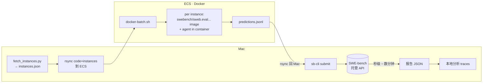

# SWE-bench 端到端工作流

**最终方案**：Mac 准备题集 → ECS 跑 **agent in instance Docker**（self-verify）→ predictions.jsonl → **sb-cli 托管评分**。



| 阶段 | 在哪 | 工具 |
|------|------|------|
| 拉题集 | Mac | `fetch_instances.py`（一次性 venv） |
| 跑 agent + self-verify | **ECS Docker** | `docker-batch.sh` 调 instance image，agent 在 `/testbed` 直接跑 pytest |
| 评分 | SWE-bench 托管 | `sb-cli submit` |
| 调试单题 | ECS Docker | `docker-smoke.sh <id>`（流式 stdout） |
| 看 trace | Mac | rsync 回 `logs/<id>/agent.log` |

> **为什么 agent 必须在 docker 里**：SWE-bench 题目的 fix 几乎都需要跑 pytest 验证。Mac 本地 worktree 没有 python 依赖 + 测试套件配置，agent 只能盲改，基线分会 < 10%。在 instance image 里 agent 能直接 `conda activate testbed && pytest`。

---

## 0. 一次性准备

### 0.1 Mac

| 任务 | 命令 |
|------|------|
| Forgelet 依赖 | `pnpm install` |
| 数据集 venv | `pnpm eval:swe:setup` |
| sb-cli | `brew install pipx && pipx install sb-cli && pipx inject sb-cli typing_extensions` |
| sb-cli API key | `sb-cli gen-api-key <你的邮箱>` → 邮箱拿 code → `sb-cli verify-api-key <code>` |
| `~/.zshrc` | `export SWEBENCH_API_KEY=<key>` + `export PATH="$HOME/.local/bin:$PATH"` |
| `.env` | `DEEPSEEK_API_KEY=...` 放仓库根，自动被 batch 透传到 container |

### 0.2 ECS（首次配 / 换机时）

| 任务 | 命令 |
|------|------|
| ssh 公钥免密 | 把本地 `~/.ssh/id_*.pub` 加到 ECS 的 `~/.ssh/authorized_keys` |
| Docker | 标配（绝大多数云镜像自带） |
| Node 20（不能跟 host 共享 .so） | `mkdir ~/node-prebuilt && wget -qO- https://nodejs.org/dist/v20.18.0/node-v20.18.0-linux-x64.tar.xz \| tar -xJ -C ~/node-prebuilt && mv ~/node-prebuilt/node-* ~/node-prebuilt/node-v20` |
| pnpm | `sudo apt install -y npm && sudo npm i -g pnpm@9` |
| sync 代码 | `rsync -avz --exclude node_modules --exclude .git ./ ubuntu@$ECS_IP:~/coding-agent-chat-oss/` |
| 装依赖 + build | `ssh ubuntu@$ECS_IP 'cd ~/coding-agent-chat-oss && ELECTRON_SKIP_BINARY_DOWNLOAD=1 pnpm install && pnpm --filter @forgelet/sdk-runtime build'` |
| `.env` | `scp .env ubuntu@$ECS_IP:~/coding-agent-chat-oss/.env`（含 `DEEPSEEK_API_KEY`） |

> **sb-cli 配额**：lite/test 默认 10/月，lite/dev 10/月，swe-bench-m/dev 100/月，verified 邮件 `support@swebench.com` 申请。`sb-cli get-quotas` 查余额。

### 0.3 sb-cli 配额表

| 数据集 / split | 默认 quota |
|----------------|-----------|
| `swe-bench_lite` / test | 10 |
| `swe-bench_lite` / dev  | 10 |
| `swe-bench-m`    / dev  | 100 |
| `swe-bench-m`    / test | 10 |
| `swe-bench_verified` | 需邮件申请 |

---

## 1. 完整流程

### 1.1 拉题集（Mac，首次 / 换数据集）

```bash
mkdir -p ~/.forgelet/runs/swe-bench/lite-full
cd packages/harness/eval/swe-bench
.venv/bin/python fetch_instances.py \
  --dataset lite \
  --output ~/.forgelet/runs/swe-bench/lite-full/instances.json
# 300 条 instances.json
```

切片：

```bash
jq '.[0:50]' ~/.forgelet/runs/swe-bench/lite-full/instances.json \
  > ~/.forgelet/runs/swe-bench/lite-50/instances.json
```

### 1.2 同步到 ECS

```bash
export ECS_IP=119.91.220.67          # 改成你的

# 同步切片好的 instances
ssh ubuntu@$ECS_IP 'mkdir -p ~/swe-batch'
rsync -avz ~/.forgelet/runs/swe-bench/lite-50/instances.json \
  ubuntu@$ECS_IP:~/swe-batch/

# 同步代码（改了 prompt / agent 逻辑就要重 sync + rebuild）
rsync -avz --exclude node_modules --exclude .git \
  ./ ubuntu@$ECS_IP:~/coding-agent-chat-oss/
ssh ubuntu@$ECS_IP 'cd ~/coding-agent-chat-oss && pnpm --filter @forgelet/sdk-runtime build'
```

> ⚠️ **`@forgelet/sdk-runtime` 的 `package.json` 是 `"main": "dist/index.js"`，sync 后必须 rebuild**——否则 `apps/cli` import 进来的还是旧 dist。同样道理任何 `packages/*` 改了 src 都要重 build。

### 1.3 在 ECS 跑 docker batch

```bash
ssh ubuntu@$ECS_IP 'cd ~/coding-agent-chat-oss && \
  cp packages/harness/eval/swe-bench/docker-batch.sh ~/docker-batch.sh && \
  chmod +x ~/docker-batch.sh'

# 启动（后台 + nohup，预计 2-3h）
ssh ubuntu@$ECS_IP 'nohup ~/docker-batch.sh ~/swe-batch/instances.json ~/swe-batch/lite-50 \
  > ~/swe-batch/lite-50.log 2>&1 </dev/null & echo "pid=$!"'

# 看进度
ssh ubuntu@$ECS_IP 'wc -l ~/swe-batch/lite-50/done.txt; tail -3 ~/swe-batch/lite-50/summary.tsv'
```

| 产出（ECS `~/swe-batch/lite-50/`） | 说明 |
|------------------------------------|------|
| `predictions.jsonl` | `{instance_id, model_name_or_path, model_patch}` 一行一题 |
| `summary.tsv` | `<id>\t<OK\|FAIL_PULL\|FAIL_RUN>\t<patch_lines>\t<elapsed_s>` |
| `done.txt` | 完成的 id 列表，重跑会 skip（resume-safe） |
| `logs/<id>/agent.log` | agent 实际 stdout（含工具调用 / pytest 输出） |
| `logs/<id>/agent.patch` | 容器内 `git diff` 的产物 |

**调参**（env vars）：

```bash
KEEP_IMAGES=20 PER_INSTANCE_TIMEOUT=900 MODEL_NAME=forgelet-docker-v2 \
  ~/docker-batch.sh ~/swe-batch/instances.json ~/swe-batch/lite-50
```

| 变量 | 默认 | 作用 |
|------|------|------|
| `KEEP_IMAGES` | 15 | LRU 保留最近 N 个 `swebench/sweb.eval.*` image（每个 ~4GB） |
| `PER_INSTANCE_TIMEOUT` | 600s | 单题超时（含 LLM 思考 + 工具调用） |
| `MODEL_NAME` | `forgelet-docker` | 写入 predictions.jsonl 的 `model_name_or_path` |

### 1.4 拉 predictions 回 Mac

```bash
RUN_ID=lite-50-docker
mkdir -p ~/.forgelet/runs/swe-bench/$RUN_ID
rsync -avz ubuntu@$ECS_IP:~/swe-batch/lite-50/ \
  ~/.forgelet/runs/swe-bench/$RUN_ID/
```

### 1.5 提交评分

```bash
sb-cli submit swe-bench_lite test \
  --predictions_path ~/.forgelet/runs/swe-bench/$RUN_ID/predictions.jsonl \
  --run_id $RUN_ID \
  --output_dir ~/.forgelet/runs/swe-bench/sb-cli-reports
```

默认 watch 到完成（≤ 20 min，通常秒级 ~ 1 分钟）。`--no-watch` + 异步取：

```bash
sb-cli get-report swe-bench_lite test $RUN_ID \
  -o ~/.forgelet/runs/swe-bench/sb-cli-reports --overwrite 1
```

### 1.6 看分

```bash
REPORT=~/.forgelet/runs/swe-bench/sb-cli-reports/Subset.swe_bench_lite__test__$RUN_ID.json
jq '{submitted_instances, completed_instances, resolved_instances, failed_instances,
     resolved_ids, failed_ids: (.failed_ids|length)}' "$REPORT"
```

| 字段 | 含义 |
|------|------|
| `submitted_instances` | 实际提交的条数 |
| `completed_instances` | resolved + unresolved |
| `resolved_instances` | **测试全过** ← 关键分数 |
| `unresolved_instances` | patch 应用了但 FAIL_TO_PASS 没全过 |
| `failed_instances` | patch 应用失败 / pytest crash |
| `error_instances` | 评测基建出错（罕见） |

> sb-cli 只回汇总 + per-instance ID，**不回单题日志**。要看为什么 fail，回 `logs/<id>/agent.log` + `agent.patch` vs gold patch。

---

## 2. 排查 failed / unresolved

```bash
# 1. 看 agent 的 patch
jq -r 'select(.instance_id=="<id>") | .model_patch' \
  ~/.forgelet/runs/swe-bench/$RUN_ID/predictions.jsonl > /tmp/agent.patch

# 2. 跟 gold patch 对比
jq -r '.[] | select(.instance_id=="<id>") | .patch' \
  ~/.forgelet/runs/swe-bench/lite-full/instances.json > /tmp/gold.patch
diff /tmp/gold.patch /tmp/agent.patch

# 3. 看 agent 的实际行为
less ~/.forgelet/runs/swe-bench/$RUN_ID/logs/<id>/agent.log
```

`diff` 能立刻告诉你：
- agent 改的范围是否覆盖了 gold patch
- 改的方向对不对
- 是不是"改头一动后面不管"型错误

要重跑单题：

```bash
ssh ubuntu@$ECS_IP '~/docker-smoke.sh <id> ~/swe-batch/instances.json'
# 看 ~/.forgelet/runs/docker-smoke/<id>/agent.{log,patch}
```

---

## 3. 降级路径：Mac-only（无 docker / 快速 prompt 调参时）

**不能 self-verify**，基线分 < 10%，**只用于 prompt / 工具链快速验证**：

```bash
RUN=lite-mac-debug
pnpm --filter @forgelet/harness eval:swe -- \
  --instances ~/.forgelet/runs/swe-bench/lite-50/instances.json \
  --output ~/.forgelet/runs/swe-bench/$RUN \
  --skip-eval --max-turns 50 --timeout-s 600 --run-id $RUN
sb-cli submit swe-bench_lite test \
  --predictions_path ~/.forgelet/runs/swe-bench/$RUN/predictions.jsonl \
  --run_id $RUN
```

| 标志 | 作用 |
|------|------|
| `--instances <path>` | 用已有 JSON，跳过 `fetch_instances.py` |
| `--skip-eval` | 跳过本地 `evaluate.sh`（不需要 Docker） |
| `--max-turns N` | agent 单题最多 N 个工具调用 |
| `--resume` | 接着 `predictions.jsonl` 已有条目继续 |

---

## 4. 常见问题

| 现象 | 原因 / 修法 |
|------|-------------|
| `LLM API error 404` | 用了带 `/anthropic` 后缀的 baseUrl。`packages/sdk-runtime/src/providers/presets.ts` 已统一为裸 `https://api.deepseek.com`，确认 ECS 上 `dist/` 也 build 过 |
| `ModuleNotFoundError: No module named 'erfa'` | container 内 conda 没激活，确认 `source /opt/miniconda3/etc/profile.d/conda.sh && conda activate testbed` 在 `bash -lc` 里 |
| `libnode.so.109: not found` | 直接挂 host node 不行，用预编译 tarball：`~/node-prebuilt/node-v20/bin/node` |
| `Missing /tmp/<id>.json` | 旧版 smoke 脚本依赖；新版 `docker-smoke.sh` 自动从 instances.json 读 |
| `FAIL_PULL` | docker hub 偶发限流 / 网络抖动，等一会儿手动重跑这一题：`grep -v <id> done.txt > done.txt.new && mv done.txt.new done.txt && ~/docker-batch.sh ...`（resume-safe） |
| 单题超时 | 调 `PER_INSTANCE_TIMEOUT`，或看 agent.log 是不是死循环 |
| ECS 磁盘满 | `KEEP_IMAGES` 调小，或手动 `docker image prune -a -f --filter "until=2h"` |
| Mac-only 路径分数极低 | 正常，没 self-verify。走 §1 ECS docker 路径 |

---

## 5. 关键脚本

| 路径 | 用途 |
|------|------|
| [`docker-batch.sh`](./docker-batch.sh) | 批量跑 N 题，输出 `predictions.jsonl` |
| [`docker-smoke.sh`](./docker-smoke.sh) | 单题跑（流式 stdout，调试用） |
| [`run.ts`](./run.ts) | Mac-only 路径入口（`pnpm eval:swe`） |
| [`fetch_instances.py`](./fetch_instances.py) | 一次性拉 HF 数据集 |
| [`evaluate.sh`](./evaluate.sh) | 老的本地 docker 评分脚本，**sb-cli 出现后不再需要** |

---

## 6. 速查命令

```bash
# 一次性
brew install pipx && pipx install sb-cli && pipx inject sb-cli typing_extensions
sb-cli gen-api-key <你的邮箱>
sb-cli verify-api-key <code>
sb-cli get-quotas
pnpm install
pnpm eval:swe:setup

# 拉题集 + 切片
mkdir -p ~/.forgelet/runs/swe-bench/lite-full
packages/harness/eval/swe-bench/.venv/bin/python \
  packages/harness/eval/swe-bench/fetch_instances.py \
  --dataset lite --output ~/.forgelet/runs/swe-bench/lite-full/instances.json
jq '.[0:50]' ~/.forgelet/runs/swe-bench/lite-full/instances.json \
  > ~/.forgelet/runs/swe-bench/lite-50/instances.json

# Sync + 跑 batch
export ECS_IP=119.91.220.67
rsync -avz --exclude node_modules --exclude .git ./ ubuntu@$ECS_IP:~/coding-agent-chat-oss/
ssh ubuntu@$ECS_IP 'cd ~/coding-agent-chat-oss && pnpm --filter @forgelet/sdk-runtime build && \
  cp packages/harness/eval/swe-bench/docker-batch.sh ~/docker-batch.sh && chmod +x ~/docker-batch.sh'
rsync -avz ~/.forgelet/runs/swe-bench/lite-50/instances.json ubuntu@$ECS_IP:~/swe-batch/
ssh ubuntu@$ECS_IP 'nohup ~/docker-batch.sh ~/swe-batch/instances.json ~/swe-batch/lite-50 \
  > ~/swe-batch/lite-50.log 2>&1 </dev/null & echo "pid=$!"'

# 监控
ssh ubuntu@$ECS_IP 'wc -l ~/swe-batch/lite-50/done.txt; tail -3 ~/swe-batch/lite-50/summary.tsv'

# 拉回 + 提交
RUN=lite-50-docker
mkdir -p ~/.forgelet/runs/swe-bench/$RUN
rsync -avz ubuntu@$ECS_IP:~/swe-batch/lite-50/ ~/.forgelet/runs/swe-bench/$RUN/
sb-cli submit swe-bench_lite test \
  --predictions_path ~/.forgelet/runs/swe-bench/$RUN/predictions.jsonl \
  --run_id $RUN \
  --output_dir ~/.forgelet/runs/swe-bench/sb-cli-reports

# 看分
jq '{resolved_instances, failed_instances, submitted_instances}' \
  ~/.forgelet/runs/swe-bench/sb-cli-reports/Subset.swe_bench_lite__test__$RUN.json

# 排查单题
less ~/.forgelet/runs/swe-bench/$RUN/logs/<id>/agent.log
ssh ubuntu@$ECS_IP '~/docker-smoke.sh <id> ~/swe-batch/instances.json'
```
