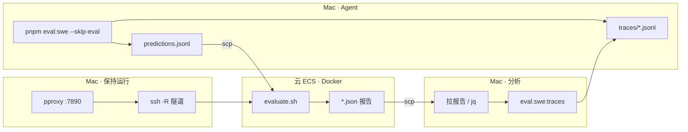

# SWE-bench 端到端工作流

Mac 生成 patch → 云 ECS Docker 阅卷 → 拉回 `resolved_ids` / `unresolved_ids` → Mac 用轨迹分析 Agent。



## 0. 一次性准备

| 位置 | 内容 |
|------|------|
| Mac | `pnpm install`、`pnpm eval:swe:setup`、根目录 `.env` 里 `DEEPSEEK_API_KEY` |
| 云 ECS | Docker、镜像加速、`~/forgelet-eval`（`evaluate.sh` + `.venv`）、HF 离线缓存 |
| Mac↔云 | `start-proxy-tunnel.sh <ECS_IP>`（pproxy + ssh -R） |

## 1. Mac：Agent 生成 patch（本地）

```bash
pnpm eval:swe -- \
  --dataset lite \
  --run-id my-run \
  --instance-ids astropy__astropy-12907,astropy__astropy-14182,astropy__astropy-14365 \
  --skip-eval
```

| 产出 | 路径 |
|------|------|
| predictions | `~/.forgelet/runs/swe-bench/eval-<run-id>/predictions.jsonl` |
| 运行报告 | `~/.forgelet/runs/swe-bench/eval-<run-id>/run-report.json` |
| Agent 轨迹 | `~/.forgelet/traces/swe-bench/eval-<run-id>/instances/<instance_id>.jsonl` |

日志里会打印 **Run ID** 和 **Traces** 目录。轨迹默认开启；关闭用 `--no-trace`。

## 2. Mac：开代理隧道（云评测前）

```bash
.cursor/skills/swe-bench-eval/scripts/start-proxy-tunnel.sh <ECS_IP>
```

评测期间 **不要关** 这两个进程。

## 3. 上传 + 云 ECS：Docker 评测

```bash
# Mac
scp ~/.forgelet/runs/swe-bench/eval-my-run/predictions.jsonl \
  ubuntu@<ECS_IP>:~/forgelet-eval/predictions.jsonl

# 或打印完整命令块
.cursor/skills/swe-bench-eval/scripts/print-cloud-commands.sh my-run <ECS_IP>
```

云上：

```bash
export http_proxy=http://127.0.0.1:7890 https_proxy=http://127.0.0.1:7890
export HTTP_PROXY=http://127.0.0.1:7890 HTTPS_PROXY=http://127.0.0.1:7890
export NO_PROXY=localhost,127.0.0.1,mirror.ccs.tencentyun.com
export HF_HOME=$HOME/.cache/huggingface HF_HUB_OFFLINE=1 HF_DATASETS_OFFLINE=1
cd ~/forgelet-eval && export SWEBENCH_PYTHON=$HOME/forgelet-eval/.venv/bin/python
bash evaluate.sh ~/forgelet-eval/predictions.jsonl SWE-bench/SWE-bench_Lite my-run 1
```

结束时会写：`deepseek-v4-pro.my-run.json`（模型名以你 Agent 的 `--model` 为准）。

## 4. 看 resolved / unresolved

**云上：**

```bash
jq '{resolved_ids, unresolved_ids}' ~/forgelet-eval/deepseek-v4-pro.my-run.json
```

| 字段 | 含义 |
|------|------|
| `resolved_ids` | 测试全过 |
| `unresolved_ids` | patch 已应用但测试未全过（要分析 Agent） |
| `incomplete_ids` | 本次未提交，不是失败 |

**拉回 Mac（建议固定目录）：**

```bash
mkdir -p packages/harness/eval/swe-bench/runs/eval-my-run/cloud-results
scp ubuntu@<ECS_IP>:~/forgelet-eval/deepseek-v4-pro.my-run.json \
  packages/harness/eval/swe-bench/runs/eval-my-run/cloud-results/
```

## 5. Mac：用轨迹分析 Agent（针对 unresolved）

**一条命令（已有本地报告时）：**

```bash
pnpm eval:swe:analyze -- my-run
# 自动 scp 报告：pnpm eval:swe:analyze -- my-run <ECS_IP>
```

**或分步：**

```bash
# 所有 instance 轨迹摘要
pnpm eval:swe:traces -- --run-id my-run

# 只看失败的一条
pnpm eval:swe:traces -- --run-id my-run --instance astropy__astropy-14182

# 看 Agent 产出的 diff
grep astropy__astropy-14182 \
  ~/.forgelet/runs/swe-bench/eval-my-run/predictions.jsonl | jq -r .model_patch | less

# 看原始事件（最后几次 tool.called）
jq 'select(.event.type=="tool.called") | .event.payload.toolName' \
  ~/.forgelet/traces/swe-bench/eval-my-run/instances/astropy__astropy-14182.jsonl | tail -10
```

**云上 Docker 测试日志（可选）：**

```bash
scp -r ubuntu@<ECS_IP>:~/forgelet-eval/logs \
  packages/harness/eval/swe-bench/runs/eval-my-run/cloud-results/
```

## 6. 排查顺序（unresolved 一条）

1. `unresolved_ids` 确认 instance_id  
2. `predictions.jsonl` → patch 是否合理、是否改错文件  
3. `traces/<id>.jsonl` → 工具调用、是否过早结束  
4. 云 `logs/` → 哪些 FAIL_TO_PASS 仍红  

## 速查命令

```bash
pnpm eval:swe:setup              # Python 依赖
pnpm eval:swe -- --skip-eval …   # Mac Agent
pnpm eval:swe:traces -- --run-id <id>
pnpm eval:swe:analyze -- <run-id> [ecs-ip]
```
