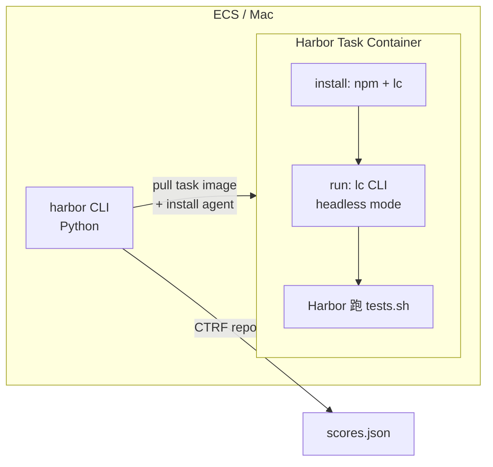
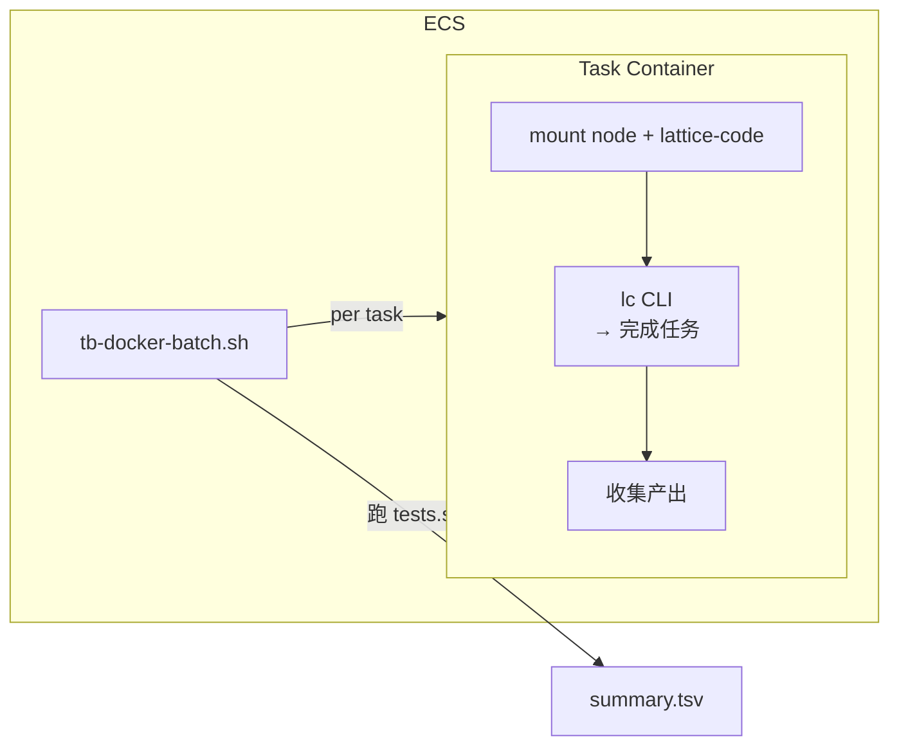

# Terminal-Bench 评测接入方案

## 背景

[Terminal-Bench](https://www.tbench.ai) 是一个评测 AI agent 在**真实终端任务**上表现的 benchmark。与 SWE-bench 聚焦 Python 仓库 bug fix 不同，Terminal-Bench 覆盖 12 类通用 CLI 操作（文件处理、Git、系统管理、Web 开发、数据管道、安全修复等），更接近 DevOps/SRE 日常工作。

| 对比 | SWE-bench | Terminal-Bench 2.1 |
|------|-----------|-------------------|
| 任务数 | 500 (Lite 300) | 89 |
| 领域 | Python repo bug fix | 12 类终端任务 |
| 环境 | `swebench/sweb.eval.*` Docker image | Harbor task 容器 |
| 评分 | `swebench.harness.run_evaluation` | 每题自带 `tests.sh`，Harbor 自动跑 |
| 框架 | 自有 harness / sb-cli | [Harbor](https://github.com/harbor-framework/harbor) |
| 指标 | % resolved | pass@1 (首次通过率) |
| 排行榜 | swebench.com | tbench.ai |

**当前排行参考（2.0）：**

| Agent | Model | Score |
|-------|-------|-------|
| vix | Claude Opus 4.7 | 90.2% |
| Codex CLI | GPT-5.5 | 82% |
| Claude Code | Opus 4.5 | 58% |
| OpenHands | Opus 4.5 | ~50% |
| Gemini CLI | 2.5 Pro | 52% |

## 目标

1. 让 Lattice Code agent 能跑通 Terminal-Bench，获得基线分数
2. 建立可复用的评测流程，支持 A/B 对比调优
3. 复用 SWE-bench 已有基础设施（ECS + Docker），最小化新增运维开销

---

## 方案选型

### 方案 A：Harbor 原生集成（推荐）



写一个 ~100 行 Python 薄壳（`BaseInstalledAgent`），在 Harbor task 容器内 `install()` Node.js + Lattice Code，`run()` 调 CLI headless 模式。Harbor 自动处理镜像拉取、timeout、评分、日志收集。

**优点：**
- 与 Claude Code / Codex CLI 同等地位，可直接对比
- 评分由 Harbor 管理，无需自建
- 可提交到 tbench.ai 排行榜
- 支持 `--n-concurrent` 并发、Daytona 云端运行

**缺点：**
- 依赖 Harbor Python 环境（`pip install harbor`）
- agent 在容器内运行，调试体验不如 SWE-bench 的 docker-smoke.sh 直观

### 方案 B：自建 Docker 批跑（SWE-bench 模式）



参照 `docker-batch.sh`，写 `tb-docker-batch.sh`：遍历 Terminal-Bench 任务列表 → 拉 task image → mount Node + Lattice Code → 跑 agent → 跑 tests.sh → 收集结果。

**优点：**
- 复用 SWE-bench 运维经验，团队最熟悉
- 无需装 Harbor Python 环境
- 完全可控的调试流程（smoke / trace-rerun）

**缺点：**
- 需要理解 Terminal-Bench 的 task 格式和 image 命名规则
- 评分逻辑需自建（虽然只是跑 `tests.sh`）
- 无法直接提交排行榜（需额外适配）

### 选择

**先 A 后 B**。用方案 A 快速获得基线分数 + 排行榜位置（~1-2 天），再按需落地方案 B 做深度调试（调优期）。两个方案不互斥。

---

## 方案 A 详细设计

### 1. 环境准备

| 机器 | 需装 | 说明 |
|------|------|------|
| Mac / ECS | `pip install harbor` | Harbor CLI (~200MB) |
| Mac / ECS | Docker | 已有 |
| （可选）| Daytona 账号 | 云端并发 100+ 容器 |

```bash
# 一次性
pip install harbor
export DEEPSEEK_API_KEY=...
# 或 ANTHROPIC_API_KEY / OPENAI_API_KEY（视 backbone model）
```

### 2. Agent 集成文件

创建 `packages/harness/eval/terminal-bench/lattice_code_agent.py`：

```python
"""Harbor agent adapter for Lattice Code CLI."""
import shlex
from harbor.agents.installed.base import BaseInstalledAgent, with_prompt_template
from harbor.environments.base import BaseEnvironment
from harbor.models.agent.context import AgentContext


class LatticeCodeAgent(BaseInstalledAgent):
    """Runs the Lattice Code CLI agent inside a Harbor task container."""

    SUPPORTS_ATIF = False

    @staticmethod
    def name() -> str:
        return "lc"

    def version(self) -> str | None:
        return "0.1.0"

    async def install(self, environment: BaseEnvironment) -> None:
        # 1. 装 Node.js 20 (task image 不一定有)
        await self.exec_as_root(environment, command=(
            "curl -fsSL https://deb.nodesource.com/setup_20.x | bash - "
            "&& apt-get install -y nodejs"
        ))
        # 2. 把 Lattice Code 源码 + 依赖 copy 进容器
        #    生产方式：发布 npm 包后直接 npm install -g lc
        #    开发方式：mount 宿主机目录（见下文 harbor job YAML）
        await self.exec_as_agent(environment, command=(
            "cd /lattice-code && npm install --ignore-scripts 2>/dev/null || true"
        ))

    @with_prompt_template
    async def run(
        self,
        instruction: str,
        environment: BaseEnvironment,
        context: AgentContext,
    ) -> None:
        escaped = shlex.quote(instruction)
        await self.exec_as_agent(
            environment,
            command=(
                f"cd /home/user && "
                f"node /lattice-code/node_modules/tsx/dist/cli.mjs "
                f"/lattice-code/apps/cli/src/main.ts "
                f"-c /home/user -y --no-trace {escaped}"
            ),
        )
```

### 3. 运行方式

```bash
# 跑全量 89 题
harbor run \
  --dataset terminal-bench@2.1 \
  --agent-import-path lattice_code_agent:LatticeCodeAgent \
  --model deepseek/deepseek-chat \
  --n-concurrent 4 \
  --timeout 600

# 跑单题调试
harbor run \
  --dataset terminal-bench@2.1 \
  --task-id hello-world \
  --agent-import-path lattice_code_agent:LatticeCodeAgent \
  --model deepseek/deepseek-chat
```

### 4. ECS 部署（复用现有 SWE-bench 机器）

```bash
# Mac → ECS
rsync -avz --exclude node_modules --exclude .git \
  packages/harness/eval/terminal-bench/ \
  ubuntu@$ECS_IP:~/terminal-bench-eval/

# ECS
pip install harbor
cd ~/terminal-bench-eval
harbor run -d terminal-bench@2.1 \
  --agent-import-path lattice_code_agent:LatticeCodeAgent \
  --model deepseek/deepseek-chat \
  --n-concurrent 4
```

---

## 方案 B 详细设计（后续调优期）

参照 SWE-bench 的 `docker-batch.sh` + `docker-smoke.sh`，建一套独立脚本：

| 脚本 | 作用 |
|------|------|
| `fetch-tasks.sh` | 从 Harbor registry 拉 Terminal-Bench task 列表 + image |
| `tb-docker-batch.sh` | 批量跑：per task 起容器 → mount node/lattice-code → agent 跑 → tests.sh 跑 → 收集结果 |
| `tb-docker-smoke.sh` | 单题调试，流式 stdout |
| `tb-docker-trace-rerun.sh` | 开 trace 重跑，根因分析 |
| `tb-report.py` | 汇总 pass/fail + cost |

容器内流程：

```bash
# Harbor task container
export PATH=/opt/node/bin:$PATH
cd /home/user  # 或 task 指定的 workdir

# 跑 agent
timeout $TIMEOUT node /lattice-code/node_modules/tsx/dist/cli.mjs \
  /lattice-code/apps/cli/src/main.ts -c . -y --no-trace "$INSTRUCTION" \
  > /work/agent.log 2>&1

# 评分
bash /task/tests.sh > /work/test-result.txt 2>&1
```

---

## 需要适配的 Agent 改动

### P0（必做，接入前）

| 项 | 说明 | 改动范围 |
|----|------|---------|
| **System prompt 泛化** | 当前 prompt 偏向"修 Python 代码"，Terminal-Bench 需要通用终端任务能力。加一段 terminal-task aware 的指引：鼓励探索环境、读 task 说明、善用 bash 管道 | `prompt.ts` 或通过 `LATTICE_CODE_SYSTEM_PROMPT_EXTRA` env var 注入 |
| **bash timeout 放宽** | 部分 task 需要编译/装包，60s 可能不够 | `definitions.ts` 中 `timeout_ms` 默认值或 env var 覆盖 |

### P1（跑通后优化）

| 项 | 说明 |
|----|------|
| **Reason hook 适配** | Terminal-Bench 任务没有统一 git diff 语义，Reason 的 `getCurrentDiff` 需要适配（或关闭） |
| **Verify hook 适配** | 无统一 pytest 入口。可考虑让 Verify 跑 task 自带的 `tests.sh`（如果路径可获取） |
| **探索预算调整** | Terminal-Bench 任务可能需要更多探索（ls / cat / find），`explorationBudget` 15 可能太紧 |

### P2（竞争力提升）

| 项 | 说明 |
|----|------|
| **专用 prompt template** | 分析错误模式后，针对高频失败类别（如 system admin / data processing）加专项指引 |
| **Tool 扩展** | 考虑加 `curl` / `wget` wrapper tool（部分 task 需要网络操作） |
| **多模型 A/B** | DeepSeek vs Claude vs GPT backbone 对比 |

---

## 预期时间线

| 阶段 | 工作 | 耗时 | 产出 |
|------|------|------|------|
| **Phase 1: 跑通** | 写 `lattice_code_agent.py` + 装 Harbor + hello-world 验证 | 0.5 天 | agent 在 Harbor 里跑通 |
| **Phase 2: 基线** | 全量 89 题，不改 prompt | 0.5 天 | 基线分数 |
| **Phase 3: P0 适配** | system prompt 泛化 + bash timeout | 0.5 天 | 适配后分数 |
| **Phase 4: 调优** | 分析错误 → prompt tuning → A/B | 持续 | 逐步提分 |
| **Phase 5: 上榜** | 提交到 tbench.ai | 0.5 天 | 排行榜位置 |

---

## 风险与缓解

| 风险 | 影响 | 缓解 |
|------|------|------|
| Terminal-Bench task image 没有网络 | 部分需要下载的任务会失败 | 确认 Harbor 网络策略；必要时用 `--network host` |
| Node.js 安装失败（某些 minimal image） | agent 跑不起来 | 备选：静态链接 Node binary，或预构建 Docker layer |
| Harbor API 变更 | agent wrapper 坏 | Pin harbor 版本 |
| DeepSeek 在非代码任务上表现弱 | 基线分低 | 多模型对比；Terminal-Bench 友好的 prompt |
| 89 题 API 成本 | ~$5-15（DeepSeek），~$50-100（Claude） | 先用 DeepSeek 调通，目标分用 Claude |

---

## 文件组织（目标态）

```
packages/harness/eval/terminal-bench/
├── PROPOSAL.md          ← 本文件
├── WORKFLOW.md           ← 跑通后写操作手册（参照 swe-bench/WORKFLOW.md）
├── lattice_code_agent.py     ← Harbor BaseInstalledAgent adapter
├── tb-docker-batch.sh    ← 自建批跑脚本（Phase 2+）
├── tb-docker-smoke.sh    ← 单题调试
├── tb-report.py          ← 结果汇总
└── prompt-extra.txt      ← Terminal-Bench 专用 system prompt 补丁
```
