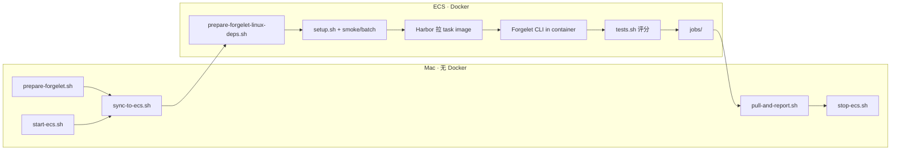

# Terminal-Bench 端到端工作流

**最终方案**：Mac 准备 Forgelet staging + sync → **按需开机 ECS** → **ECS 跑 Harbor**（Docker Compose 起 task 容器，容器内 Forgelet CLI）→ Harbor 自动 `tests.sh` 评分 → Mac 拉 job 报告 → **API 关机省云费**。

> Mac **不需要 Docker**，也**不要**在 Mac 上跑 `setup.sh` / `smoke.sh`。Harbor 必须在有 Docker 的 ECS 上跑。
>
> 💡 **ECS 开关机**：与 SWE-bench 共用同一台 CVM 时，用 SWE-bench [WORKFLOW §0.3](../swe-bench/WORKFLOW.md#03-腾讯云-ecs-开关机推荐--省钱) 的 `start-ecs.sh` / `stop-ecs.sh`（腾讯云 API）。

**集成状态（2026-05）**：已在 ECS 上跑通 Harbor 0.9 + `forgelet_agent` 全链路（装环境 → 上传 Forgelet → agent 执行 → verifier 打分）。smoke 出现 **0 分但 Exceptions=0** 表示基建 OK、题目未过官方测试（见 §5）。

### 路径常量（ECS 上）

```bash
export TB_REPO=~/coding-agent-chat-oss--terminal-bench
export TB_EVAL=$TB_REPO/packages/harness/eval/terminal-bench
```



| 阶段 | 在哪 | 工具 |
|------|------|------|
| **开机** | Mac | `pnpm eval:ecs:start`（见 SWE-bench WORKFLOW §0.3） |
| 打包源码 + Linux Node | **Mac** | `prepare-forgelet.sh` |
| 同步到 ECS | **Mac** | `sync-to-ecs.sh` |
| 装 Linux `node_modules` + build | **ECS** | `prepare-forgelet-linux-deps.sh` |
| 装 Harbor | **ECS** | `setup.sh`（Python **3.12 或 3.13**） |
| 单题 smoke | **ECS** | `$TB_EVAL/smoke.sh [task-id]` |
| 全量 batch | **ECS** | `$TB_EVAL/tb-docker-batch.sh <job-name>` |
| 拉报告 | **Mac** | `pull-and-report.sh <job-name>` |
| **关机** | Mac | `pnpm eval:ecs:stop`（Harbor job 全拉完后） |

### 产物位置

| 位置 | 路径 |
|------|------|
| Mac staging | `~/.forgelet/tb-forgelet-staging` |
| ECS staging | `~/.forgelet/tb-forgelet-staging` |
| ECS Harbor jobs | `~/tb-batch/jobs/<job-name>/` |
| Mac 同步后 | `~/.forgelet/runs/terminal-bench/<job-name>/` |

---

## 0. 一次性准备

### 0.1 Mac（无 Docker）

| 任务 | 命令 |
|------|------|
| Terminal staging | `cd packages/harness/eval/terminal-bench && ./prepare-forgelet.sh` |
| `.env` | 放**主仓库**或 worktree 根；`sync-to-ecs.sh` 自动找 |
| ECS_IP | `export ECS_IP=119.91.220.67` |
| pproxy（ECS 出网用） | `python3 -m pip install --user pproxy` |
| **tccli + 腾讯云密钥** | 与 SWE-bench 相同：`.env` 配 `TENCENTCLOUD_*`、`TENCENT_ECS_REGION`、`TENCENT_ECS_INSTANCE_ID`（详见 [SWE-bench §0.3](../swe-bench/WORKFLOW.md#03-腾讯云-ecs-开关机推荐--省钱)） |

**Mac 只做**：`prepare-forgelet.sh` → `sync-to-ecs.sh`。不在 Mac 上 `pnpm install`（会生成 darwin 二进制）。

### 0.2 ECS（可与 SWE-bench 同机）

| 任务 | 命令 |
|------|------|
| Docker | `docker ps` 能跑 |
| **Docker Compose v2** | `sudo apt install -y docker-compose-v2`（Harbor 必须，仅有 `docker` 不够） |
| Python 3.12 | `sudo apt install -y python3.12 python3.12-venv` |
| Node 20 tarball（可复用 SWE） | `~/node-prebuilt/node-v20`（见 SWE-bench WORKFLOW §0.2） |
| 工作目录 | `mkdir -p ~/tb-batch` |

---

## 1. 完整流程

### 1.1 Mac：准备 + 同步

```bash
cd packages/harness/eval/terminal-bench
./prepare-forgelet.sh

export ECS_IP=119.91.220.67
export FORGELET_ENV_FILE="/path/to/coding-agent-chat-oss/.env"

# 若 ECS 已关机，先开机
pnpm --filter @forgelet/harness eval:ecs:start

./sync-to-ecs.sh
```

可选：`./bundle-harbor-for-ecs.sh` 打离线 wheel（无 pproxy 隧道时用）。

### 1.2 Mac：pproxy + ssh 反向隧道（ECS 访问 GitHub / PyPI / Harbor Hub）

与 SWE-bench WORKFLOW §1.5 相同。评测全程保持两个终端：

```bash
# Mac A
python3 -m pproxy -l http://127.0.0.1:7890 &

# Mac B（加保活，隧道僵死时重启）
ssh -N -o ServerAliveInterval=30 -o ServerAliveCountMax=3 \
  -R 7890:127.0.0.1:7890 ubuntu@$ECS_IP
```

ECS 健康检查（**务必加 `--max-time`**）：

```bash
curl -s -o /dev/null -w "github: %{http_code}\n" \
  --max-time 10 --proxy http://127.0.0.1:7890 https://github.com
# 应返回 200；无输出/超时 → 在 Mac 上重启 ssh -R
```

### 1.3 ECS：staging + Harbor + smoke

```bash
ssh ubuntu@$ECS_IP
```

```bash
export TB_REPO=~/coding-agent-chat-oss--terminal-bench
export TB_EVAL=$TB_REPO/packages/harness/eval/terminal-bench
export FORGELET_ROOT=~/.forgelet/tb-forgelet-staging

# 首次：在 ECS 装 Linux 依赖（需代理）
cd "$TB_EVAL"
https_proxy=http://127.0.0.1:7890 http_proxy=http://127.0.0.1:7890 \
  ./prepare-forgelet-linux-deps.sh

# 若 staging 尚无 .node-prebuilt，可复用 SWE 的 node：
# cp -a ~/node-prebuilt/node-v20 "$FORGELET_ROOT/.node-prebuilt/"

set -a && source "$TB_REPO/.env" && set +a

cd "$TB_EVAL"
https_proxy=http://127.0.0.1:7890 http_proxy=http://127.0.0.1:7890 ./setup.sh

mkdir -p ~/tb-batch && cd ~/tb-batch
https_proxy=http://127.0.0.1:7890 http_proxy=http://127.0.0.1:7890 \
  "$TB_EVAL"/smoke.sh
```

**smoke 成功标准**：`Exceptions: 0`，agent 跑数分钟。`Mean: 0.000` 在首跑/难题上正常（verifier 或题目难度，见 §5）。

### 1.4 ECS：全量 89 题

```bash
export TB_REPO=~/coding-agent-chat-oss--terminal-bench
export TB_EVAL=$TB_REPO/packages/harness/eval/terminal-bench
export FORGELET_ROOT=~/.forgelet/tb-forgelet-staging
set -a && source "$TB_REPO/.env" && set +a

cd ~/tb-batch
JOB=forgelet-tb-$(date +%Y%m%d)
https_proxy=http://127.0.0.1:7890 http_proxy=http://127.0.0.1:7890 \
  "$TB_EVAL"/tb-docker-batch.sh "$JOB"
```

### 1.5 Mac：拉回报告 + 关机

```bash
export ECS_IP=119.91.220.67
cd packages/harness/eval/terminal-bench
./pull-and-report.sh forgelet-tb-20260529

# Harbor job 已全部拉回后关机（与 SWE-bench 共用脚本）
pnpm --filter @forgelet/harness eval:ecs:stop
```

---

## 2. 环境变量

| 变量 | 默认 | 含义 |
|------|------|------|
| `FORGELET_HARBOR_MODEL` | `deepseek/deepseek-chat` | Harbor `--model` |
| `FORGELET_HARBOR_DATASET` | `terminal-bench/terminal-bench-2-1` | Harbor 0.9 数据集名 |
| `FORGELET_HARBOR_CONCURRENT` | `4` | 并发 trial |
| `FORGELET_HARBOR_AGENT_TIMEOUT_MULTIPLIER` | — | Harbor 0.9 agent 超时倍数 |
| `FORGELET_ROOT` | `~/.forgelet/tb-forgelet-staging` | agent staging（含 `.node-prebuilt`） |
| `FORGELET_WORKDIR` | `$HOME` | agent 启动目录；题目要求 `/app/...` 时可设 `/app` |
| `FORGELET_ENV_FILE` | — | Mac sync 时显式指定 `.env` |
| `ECS_IP` | — | sync / pull 用 |

Harbor 0.9 变更：`--dataset terminal-bench/terminal-bench-2-1`（不是 `terminal-bench@2.1`）；单题用 `--include-task-name terminal-bench/<id>`；无 `--timeout`，用 `--timeout-multiplier` / `--agent-timeout-multiplier`。

---

## 3. Agent 适配（vs SWE-bench）

| 项 | SWE-bench | Terminal-Bench |
|----|-----------|----------------|
| Harness | 自研 docker-batch | Harbor `forgelet_agent.py` |
| Node | 挂载 `~/node-prebuilt` | 上传 `FORGELET_ROOT/.node-prebuilt` 进容器 |
| Prompt | 修 Python bug | `FORGELET_TASK_HINT=terminal` + `prompt-extra.txt` |
| Reason / Verify | 可选 | **默认关闭** |
| 评分 | swebench harness | Harbor `tests.sh` → `reward.txt` |

---

## 4. 文件说明

```
terminal-bench/
├── WORKFLOW.md
├── PROPOSAL.md
├── prepare-forgelet.sh           # Mac：rsync 源码 + 下载 Linux Node tarball
├── prepare-forgelet-linux-deps.sh # ECS：pnpm install + build:deps
├── sync-to-ecs.sh                # Mac → ECS
├── pull-and-report.sh            # ECS → Mac
├── setup.sh                      # ECS：Harbor venv
├── smoke.sh                      # ECS：单题
├── tb-docker-batch.sh            # ECS：全量
├── run-harbor.sh                 # harbor run 封装
├── forgelet_agent.py             # Harbor BaseInstalledAgent
├── prompt-extra.txt
└── ...
```

---

## 5. 常见问题

**Q: `setup.sh` 报 GitHub / `uv_build` 找不到**  
A: ECS 出网拦 GitHub；且 pip 默认走 `mirrors.tencentyun.com`，经 pproxy 会失败。`setup.sh` 在设了 `https_proxy` 时会自动改用 `pypi.org`。需 Mac 开 pproxy + `ssh -R 7890:...`，或离线 wheel（`bundle-harbor-for-ecs.sh`）。

**Q: `unknown flag: --project-name` / `docker compose` 不存在**  
A: 装 `sudo apt install -y docker-compose-v2`。仅有 `docker` 包不够。

**Q: `No such option '--timeout'`**  
A: Harbor 0.9 已移除；脚本已更新，重新 sync。

**Q: `Dataset terminal-bench@2.1 not found`**  
A: 用 `terminal-bench/terminal-bench-2-1`。

**Q: smoke 跑完 Exceptions=0 但 Mean=0**  
A: **集成已通过**。0 分常见原因：① 官方 `tests.sh` 要在容器里 `apt install curl` + 拉 `uv`，task 容器出网被挡则 verifier 直接 0；② 题目难（默认 smoke 题为 `adaptive-rejection-sampler`）。看 `jobs/.../verifier/test-stdout.txt`。

**Q: `NonZeroAgentExitCodeError` / 找不到 `@forgelet/harness/dist`**  
A: ECS 上跑 `prepare-forgelet-linux-deps.sh`（含 `pnpm --filter @forgelet/cli run build:deps`）。

**Q: agent 在容器里 apt 装 Node 失败**  
A: 已改为上传 `FORGELET_ROOT/.node-prebuilt/node-v20`，勿依赖容器 apt。

**Q: curl GitHub 200 但 setup 仍失败**  
A: GitHub 与腾讯云 PyPI 镜像不是同一条路；确认 `setup.sh` 日志里是 `pip index: https://pypi.org/simple`。

**Q: ssh 隧道 curl 一直挂着**  
A: 隧道僵死（`CLOSE-WAIT`）。Mac 上 Ctrl+C 停掉 `ssh -R` 重连；curl 加 `--max-time 10`。

**Q: `source .env` 失败**  
A: Mac `export FORGELET_ENV_FILE=.../.env && ./sync-to-ecs.sh`，或 ECS `export DEEPSEEK_API_KEY=...`。

**Q: MOTD `changelogs.ubuntu.com`**  
A: 可忽略，不影响评测。

**Q: 云费太高 / ECS 空转**  
A: 不用时 `pnpm eval:ecs:stop`；跑 job 前 `pnpm eval:ecs:start`。配置见 [SWE-bench WORKFLOW §0.3](../swe-bench/WORKFLOW.md#03-腾讯云-ecs-开关机推荐--省钱)。

---

## 6. pnpm 快捷命令

| 命令 | 跑在哪 |
|------|--------|
| `pnpm eval:ecs:start` / `eval:ecs:stop` | Mac（腾讯云 API，§0.3） |
| `pnpm eval:tb:prepare` | Mac |
| `pnpm eval:tb:sync` | Mac |
| `pnpm eval:tb:setup` / `smoke` / `eval:tb` | **ECS** |
| `pnpm eval:tb:pull -- <job>` | Mac |
